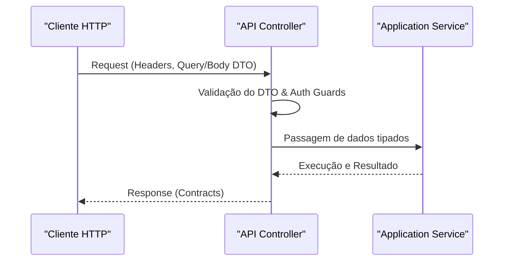

# API Request & Response Formats

## Table of Contents
- [[API/REST Endpoints]]
- [[API/GraphQL Reference]]

## Paradigma de Troca de Dados

A API utiliza Data Transfer Objects (DTOs) estritamente tipados para a validação de pedidos (`Requests`), e recorre a pacotes partilhados (como `@ecobairro/contracts`) para definir os formatos padrão de resposta (`Responses`). Este padrão assegura consistência e facilita o contrato entre o backend e quaisquer clientes da API.

> **Sources:** `apps/api/src/users/users.controller.ts:L1-L28` · `apps/api/src/reports/reports.controller.ts:L1-L83`

## Parâmetros de Pedido (Requests)

A API distingue a passagem de parâmetros essencialmente em dois métodos:

1. **Query Parameters (`@Query`)**: Utilizados intensivamente nos pedidos `GET` para filtragem de listas.
   - **Exemplo Ecopontos**: Os filtros incluem textos livres (`q`), especificidades locais (`zona`, `codigo_postal`), ou estado (`tipo`, `nivel`, `todos`). Estes parâmetros são por vezes passados como texto simples e convertidos conforme a necessidade no controlador (ex: booleanos extraídos de strings como `todos === 'true'`).
   - **Exemplo Utilizadores**: Conversão explícita de `page` e `pageSize` para numéricos.

### Paginação (`page` / `pageSize`)

A maioria das listas é **paginada na base de dados** (Prisma `skip`/`take` +
`count`), devolvendo só uma página por pedido para poupar recursos. O padrão de
query é `?page=<1-based>&pageSize=<n>` e o envelope de resposta inclui
`{ ...itens, total, page, pageSize }`. Têm-no: `users`, `reports`, `noticias`,
`partilhas`, `recolhas`, `campanhas`, `audit-logs`, e (novo) `fila`.

- **Ecopontos — paginação opt-in:** `GET /ecopontos` só pagina quando `page` é
  enviado; sem `page` devolve **tudo** (modo usado pelas vistas de mapa/agregação).
  Os filtros `tipo` (array JSON) e `nivel` (computado de `ocupacao`) são aplicados
  no `where` do Prisma — não em memória — para que `total`/`skip`/`take` sejam exatos.
- **Zonas:** `GET /ecopontos/zonas` → `{ zonas: string[] }` (distinct ativo) popula
  o filtro de zona do frontend sem carregar todos os ecopontos.

2. **Corpo do Pedido (`@Body`)**: Utilizados nos pedidos de mutação (`POST`, `PATCH`), onde a estrutura é assegurada pelos DTOs.
   - `CreateReportDto` e `UpdateReportStatusDto` para gestão de reportes.
   - `CreateEcopontoDto` e `UpdateEcopontoDto` para configuração de ecopontos e estado dos seus sensores. O tipo `sensor_estado` é explicitamente mapeado para `EcopontoSensor`.

> **Sources:** `apps/api/src/ecopontos/ecopontos.controller.ts:L50-L65` · `apps/api/src/users/users.controller.ts:L17-L25`

## Formatos de Resposta (Responses)

As respostas estão globalmente standardizadas pelo pacote de partilha comum (`@ecobairro/contracts`), importado pelos controladores para garantir a integridade dos tipos devolvidos:

- **Operações de Listagem**: Tipos terminados em `Response` (ex: `ListUsersResponse`, `ListReportsResponse`, `ListEcopontosResponse`). Sugerem um encapsulamento que provavelmente incluirá arrays de itens em conjunto com metadados de paginação ou estado.
- **Criação e Atualização**: Tipos dedicados como `CreateReportResponse` ou instâncias singulares representativas de entidades, como `EcopontoRecord`.
- **Apagamento Lógico**: Endpoints destrutivos como o `DELETE /ecopontos/:id` devolvem vazio com um `HttpCode(HttpStatus.NO_CONTENT)`, o padrão apropriado em APIs REST.

> **Sources:** `apps/api/src/reports/reports.controller.ts:L13-L18` · `apps/api/src/ecopontos/ecopontos.controller.ts:L93-L100`

---
*[[index|← Back to Index]] · Generated by repowiki*
