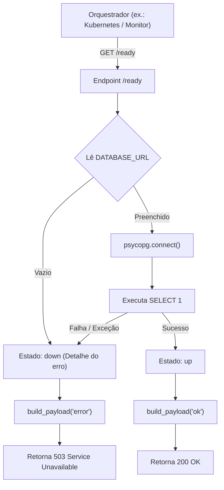

# API do Serviço de Analytics

## Table of Contents
- [[API/Endpoints Directory]]
- [[API/Auth and Session API]]
- [[API/Citizen Feedback API]]
- [[API/Ecopontos and Routes API]]

## Microsserviço de Analytics e Diagnóstico

O ecossistema do EcoBairro integra um serviço complementar e especializado em Python, utilizando o framework FastAPI. Este serviço é responsável pela execução de tarefas de processamento analítico de dados e disponibiliza endpoints dedicados à monitorização contínua do estado da infraestrutura de dados.

Uma particularidade do desenho deste microsserviço é a desativação explícita das rotas de documentação interativas automáticas da OpenAPI (Swagger/ReDoc) em produção, minimizando a superfície de exposição da API:
```python
app = FastAPI(
    title="EcoBairro Analytics",
    docs_url=None,      # Desativado
    redoc_url=None,     # Desativado
    openapi_url=None,   # Desativado
)
```



## Mecanismos de Diagnóstico e Monitorização

O serviço expõe dois endpoints principais para fins de orquestração de containers e monitorização de disponibilidade (*liveness* e *readiness*):

### 1. Verificação de Integridade Básica (`GET /health`)
Determina se o processo da aplicação Python está vivo e a responder a pedidos de rede de forma assíncrona.
*   **Comportamento**: Retorna imediatamente um payload de sucesso estruturado contendo a marca de tempo UTC em formato ISO 8601 (com o sufixo "Z" normalizado).
*   **Payload Exemplo**:
    ```json
    {
      "service": "analytics",
      "status": "ok",
      "timestamp": "2026-06-15T22:30:00Z",
      "dependencies": []
    }
    ```

### 2. Verificação de Prontidão de Dependências (`GET /ready`)
Valida se todas as dependências externas necessárias ao funcionamento do microsserviço estão operacionais. Atualmente, a dependência primária monitorizada é a base de dados relacional **PostgreSQL**.
*   **Fluxo de Execução**:
    1.  Tenta obter a variável de ambiente `DATABASE_URL`.
    2.  Caso a variável não esteja configurada, marca a dependência como indisponível (`status: "down"`).
    3.  Tenta estabelecer uma ligação ativa com o servidor PostgreSQL através do driver `psycopg` e executa um comando de validação (`SELECT 1`).
    4.  Consolida a resposta utilizando a função utilitária `build_payload()`.
*   **Códigos de Resposta HTTP**:
    *   **`200 OK`**: Se a base de dados responder com sucesso à consulta de teste.
    *   **`503 Service Unavailable`**: Se a ligação à base de dados falhar ou se a configuração estiver em falta. O corpo de resposta conterá o detalhe da exceção para diagnóstico rápido.

## Endpoints Operacionais (GESTOR/ADMIN)

Para além dos endpoints geo de cidadão (`/ecopontos/proximos`, `/reports/proximos`,
`/reports/duplicados`), o serviço expõe consultas operacionais sob `/operacional` (todas
exigem `require_roles("GESTOR","ADMIN")`): `heatmap` (OP2), `fila-prioridades` (OP3),
`reports/kpis` (R12) e **`rota-sugestao` (OP4)**.

### Sugestão de Rota (`GET /operacional/rota-sugestao`)
Calcula uma rota de recolha real (TSP por estradas) para os ecopontos que precisam de visita.

*   **Parâmetros**: `zona` (opcional), `veiculo_lat`/`veiculo_lng` (partida opcional),
    `limiar` (enchimento mínimo, default 60), `limit` (≤ 12).
*   **Seleção**: ecopontos ativos com `ocupacao >= limiar` **ou** sensor `offline`/`alerta`,
    ordenados pelo mesmo score de urgência da fila OP3.
*   **Motor**: chama o **OSRM `/trip`** (`OSRM_BASE_URL`, default público) para a ordem de
    visita e a geometria por estradas. Em falha (timeout/rede/erro) usa um **fallback greedy**
    (vizinho-mais-próximo por haversine, linhas retas) — nunca devolve mock.
*   **Sem cache** (depende da posição do veículo e do enchimento atual).
*   **Resposta** (snake_case): `{ motor: "osrm"|"greedy", zona, distancia_m, duracao_s,
    distancia_label, duracao_label, paragens:[{id,nome,lat,lng,ocupacao,ordem}], geometria }`.
    O resultado é persistido pelo NestJS via `POST /v1/rotas` (ver [[API/Ecopontos and Routes API]]).

---
> **Sources:** apps/analytics/app/main.py:L1-L84; apps/analytics/app/routers/operacional.py; apps/analytics/app/routing.py

---
*[[index|← Back to Index]] · Generated by repowiki*
