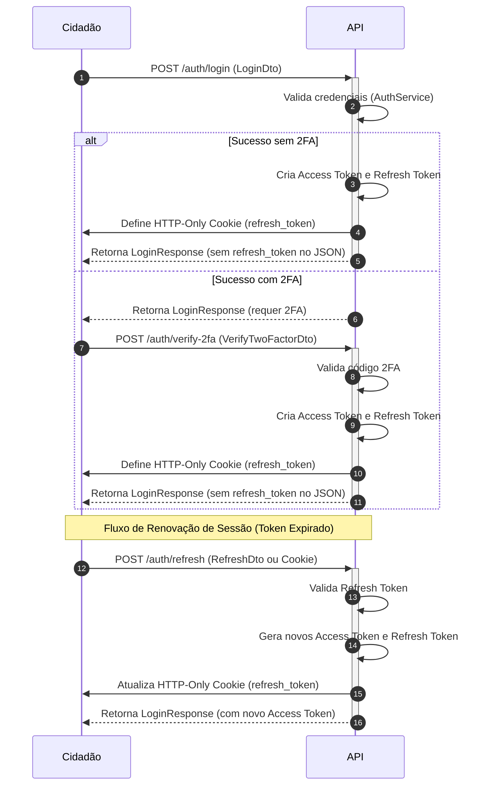

# API de Autenticação e Sessão

## Table of Contents
- [[API/Endpoints Directory]]
- [[API/Citizen Feedback API]]
- [[API/Ecopontos and Routes API]]
- [[API/Analytics Services API]]

## Gestão de Autenticação e Sessão

A segurança e o controlo de acessos dos utilizadores no EcoBairro são geridos centralmente pela `AuthController`. O ciclo de vida de uma sessão baseia-se numa estratégia de dois tokens:
*   **Access Token (JWT)**: Enviado em cabeçalhos HTTP (`Authorization: Bearer <token>`) para autorizar pedidos a recursos protegidos. Tem uma validade curta por razões de segurança.
*   **Refresh Token (JWT)**: Armazenado de forma segura no cliente. É utilizado para solicitar um novo Access Token quando o atual expirar, permitindo manter o utilizador autenticado sem necessidade de introduzir as credenciais constantemente.

Para mitigar fugas de credenciais, o Refresh Token é mantido num cookie de resposta seguro HTTP-Only e é limpo do corpo da resposta JSON antes do envio para o cliente.



## Detalhes dos Endpoints e Políticas

### 1. Registo e Confirmação de Conta
*   **Registo (`POST /auth/register`)**: Aceita `RegisterDto`. Regista um novo utilizador no sistema, gerando o contexto do pedido (`RequestContext`) que recolhe dados IP e User-Agent para segurança.
*   **Verificação de Email (`POST /auth/verify-email`)**: Aceita `VerifyEmailDto` (contendo o token enviado por email). Confirma e ativa a conta do utilizador. Retorna `204 No Content`.
*   **Reenvio de Verificação (`POST /auth/resend-verification`)**: Aceita `ForgotPasswordDto` (filtrado apenas pelo campo `email`). Reenvia o email com o token de ativação. Retorna `204 No Content`.

### 2. Controlo de Sessão e Login
*   **Login (`POST /auth/login`)**: Aceita `LoginDto`. Protegido por uma política de throttling restrita: máximo de **10 tentativas a cada 15 minutos**. Caso o utilizador tenha autenticação de dois fatores ativa, o fluxo é redirecionado.
*   **Verificação de 2FA (`POST /auth/verify-2fa`)**: Aceita `VerifyTwoFactorDto`. Conclui a autenticação de segundo fator. Também limitado por throttling (10 tentativas/15 min).
*   **Atualização de Token (`POST /auth/refresh`)**: Aceita `RefreshDto`. Se o token de atualização não estiver presente no corpo, o controlador tenta lê-lo a partir do cookie `refresh_token`. Caso contrário, lança um erro `UnauthorizedException`.
*   **Encerramento de Sessão (`POST /auth/logout`)**: Protegido por `JwtAuthGuard`. Invalida o token do lado do servidor via `AuthService` e limpa explicitamente o cookie `refresh_token` na resposta HTTP. Retorna `204 No Content`.

### 3. Recuperação de Acesso
*   **Esqueci-me da Palavra-Passe (`POST /auth/forgot-password`)**: Aceita `ForgotPasswordDto`. Dispara o envio de email para redefinição de palavra-passe.
*   **Redefinição de Palavra-Passe (`POST /auth/reset-password`)**: Aceita `ResetPasswordDto` (token e nova senha). Altera a senha do utilizador se o token for válido. Retorna `204 No Content`.

### 4. Informação do Utilizador
*   **Obter Perfil (`POST /auth/me`)**: Protegido por `JwtAuthGuard`. Utiliza o decorador `@CurrentUser` para extrair os dados da sessão do utilizador autenticado (`AuthenticatedUser`) e obter os seus detalhes.

## Configuração do Cookie de Sessão
A definição do cookie do refresh token é configurada com as seguintes regras de segurança:
```typescript
res.cookie('refresh_token', token, {
  httpOnly: true,                         // Impede o acesso ao cookie via scripts JS do cliente (proteção XSS)
  secure: process.env.NODE_ENV === 'production', // Apenas enviado sobre HTTPS em ambientes de produção
  sameSite: 'strict',                     // Proteção robusta contra CSRF
  maxAge: 7 * 24 * 60 * 60 * 1000,        // Expiração definida para 7 dias
});
```

---
> **Sources:** apps/api/src/auth/auth.controller.ts:L1-L141

---
*[[index|← Back to Index]] · Generated by repowiki*
