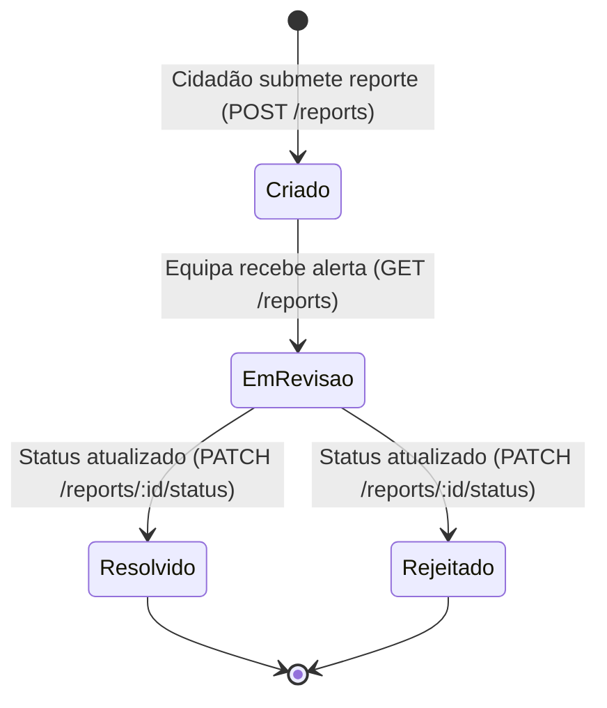

# API de Feedback do Cidadão

## Table of Contents
- [[API/Endpoints Directory]]
- [[API/Auth and Session API]]
- [[API/Ecopontos and Routes API]]
- [[API/Analytics Services API]]

## Ocorrências e Feedback de Cidadãos

A `ReportsController` é responsável por gerir a comunicação direta de anomalias ou observações de cidadãos (reportes/ocorrências) sobre a infraestrutura urbana (ex.: ecoponto danificado, lixo acumulado fora do contentor). 

Todos os endpoints desta API requerem autenticação obrigatória via `JwtAuthGuard` ao nível do controlador. A lógica de negócio assegura o isolamento de dados com base na identidade (`userId`) e no perfil/papel (`role`) do utilizador, permitindo tanto a consulta pessoal como a triagem administrativa de problemas.

## Endpoints e Permissões

### 1. Submissão de Ocorrências
*   **Criar Reporte (`POST /reports`)**: Permite a qualquer cidadão autenticado registar um problema. Aceita o DTO `CreateReportDto`. O identificador do criador e a sua role são extraídos de forma segura a partir do token de sessão para associar a autoria ao registo.

### 2. Consulta e Listagem
*   **Listar Meus Reportes (`GET /reports/me`)**: Permite ao utilizador consultar o histórico de todas as ocorrências por ele submetidas. Recebe parâmetros de paginação e filtragem através de `ListReportsDto`.
*   **Listar Todos os Reportes (`GET /reports`)**: Endpoint habitualmente utilizado por equipas de administração ou manutenção para ver o panorama geral de ocorrências no ecobairro. Aceita `ListReportsDto` e valida a autorização da operação com base no papel do utilizador (`user.role`).

### 3. Estatísticas e Métricas
*   **Obter Estatísticas (`GET /reports/stats`)**: Retorna métricas analíticas consolidadas de ocorrências com base no DTO `ReportStatsDto`. Os parâmetros principais suportados são:
    *   `scope`: O âmbito geográfico ou temporal das estatísticas.
    *   `recentLimit`: Limite máximo de registos recentes a considerar para o cálculo de tendências.

### 4. Gestão de Estado (Moderação)
*   **Atualizar Estado do Reporte (`PATCH /reports/:id/status`)**: Permite alterar o estado de processamento de um reporte específico (por exemplo, de "Aberto" para "Em Resolução" ou "Resolvido").
    *   **Identificador**: Parâmetro UUID (`:id`) validado através de um `ParseUUIDPipe`.
    *   **Corpo da Mensagem**: Aceita `UpdateReportStatusDto`, contendo o novo estado e observações.
    *   **Segurança**: O `ReportsService` valida internamente se o perfil (`role`) do utilizador tem permissões suficientes para executar esta transição de estado.

---
> **Sources:** apps/api/src/reports/reports.controller.ts:L1-L83

---
*[[index|← Back to Index]] · Generated by repowiki*
