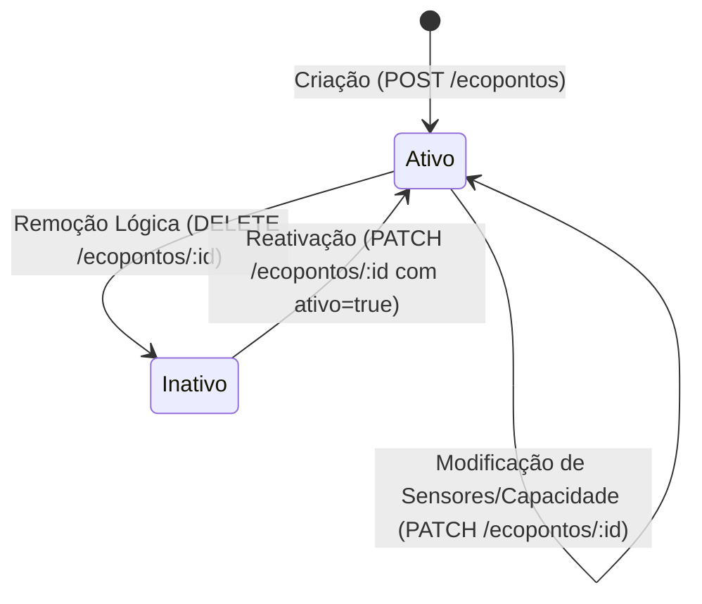

# API de Ecopontos e Rotas

## Table of Contents
- [[API/Endpoints Directory]]
- [[API/Auth and Session API]]
- [[API/Citizen Feedback API]]
- [[API/Analytics Services API]]

## Gestão da Rede de Ecopontos

A `EcopontosController` providencia a interface de programação necessária para listar, monitorizar e gerir a infraestrutura física de contentores de recolha seletiva (ecopontos). Através desta API, as aplicações clientes conseguem obter dados em tempo real sobre a localização, tipo de resíduo e níveis de ocupação dos ecopontos.

A segurança é modelada a dois níveis:
1.  **Consulta pública**: A listagem básica de ecopontos utiliza a guarda `OptionalJwtAuthGuard`, permitindo o acesso tanto a utilizadores anónimos como autenticados.
2.  **Operações administrativas**: Criação, edição e remoção exigem a guarda `JwtAuthGuard` e a validação do perfil do utilizador (`user.role`) na camada de serviço.

## Operações do Controlador

### 1. Listagem Filtrada de Ecopontos (`GET /ecopontos`)
Este endpoint disponibiliza a listagem de ecopontos e suporta filtros avançados passados via query parameters:

*   `q` (Pesquisa Livre): Procura texto correspondente em campos textuais como nome, morada, código postal ou zona.
*   `zona`: Filtro exato por zona geográfica (pesquisa case-insensitive, ex.: "Bonfim").
*   `codigo_postal`: Prefixo postal para agregação geográfica (ex.: "38" filtra códigos postais que comecem por esse prefixo).
*   `tipo`: Filtra pelo tipo de resíduo configurado (armazenado num array JSON na base de dados, ex.: "Papel").
*   `nivel` (`EcopontoNivel`): Filtro com base na ocupação computada pelos sensores (ex.: "cheio", "vazio"). Aplicado no `where` do Prisma (intervalo de `ocupacao`), não em memória, para que a contagem paginada seja exata.
*   `todos` (Booleano): Quando definido como `'true'`, inclui ecopontos inativos na resposta. Por padrão, apenas os ecopontos ativos são listados.
*   `page` / `pageSize`: **Paginação opt-in.** Se `page` for enviado, a resposta passa a `{ ecopontos, total, page, pageSize }` (Prisma `skip`/`take` + `count`). Sem `page`, devolve **todos** os resultados — modo usado pelas vistas de mapa/agregação (`mapa-sensores`, `zonas`, `home`), que precisam do conjunto completo de pontos.

> O `tipo` (array JSON) também é filtrado no `where` (`array_contains`) para manter a paginação exata.

### 1b. Zonas distintas (`GET /ecopontos/zonas`)
Devolve `{ zonas: string[] }` — as zonas ativas distintas (`SELECT DISTINCT zona`, ordenado). Serve para popular o filtro de zona do frontend sem carregar todos os ecopontos (necessário porque a listagem passou a ser paginada).

### 2. Registo de Ecoponto (`POST /ecopontos`)
Permite adicionar um novo ponto de recolha à rede de ecobairros.
*   **Parâmetros de Entrada**: Recebe o DTO `CreateEcopontoDto`.
*   **Zona derivada**: O campo `zona` **não** faz parte do corpo. É calculado pelo backend a partir de `lat`/`lng` por proximidade: herda a zona do ecoponto vizinho mais próximo a ≤ 50 m; se isolado, cria zona nova com o nome da morada (`apps/api/src/ecopontos/zona.helper.ts`).
*   **Processamento**: O estado do sensor (`sensor_estado`) é convertido explicitamente para o tipo de contrato `EcopontoSensor`.
*   **Autenticação**: Requer um token JWT ativo. A role do utilizador é enviada ao serviço para verificação de permissões administrativas.

### 3. Atualização de Dados (`PATCH /ecopontos/:id`)
Permite atualizar os metadados de um ecoponto, como o seu estado atual de ocupação comunicado por sensores de telemetria ou dados geográficos.
*   **Parâmetros de Entrada**: Um identificador do tipo UUID (`:id`) e o DTO `UpdateEcopontoDto`.
*   **Zona derivada**: Se `lat`/`lng` mudarem, a `zona` é **recalculada** por proximidade (50 m); caso contrário mantém-se. O `zona` enviado pelo cliente é ignorado.
*   **Telemetria**: Permite atualizar o estado do sensor físico associado ao ecoponto.

### 4. Remoção Lógica (Soft-Delete) (`DELETE /ecopontos/:id`)
A remoção de ecopontos no ecossistema não é destrutiva. O endpoint executa uma ação de desativação lógica (soft-delete).
*   **Implementação**: Define o campo `ativo` do registo correspondente para `false`.
*   **Resultado**: O ecoponto deixa de aparecer em listagens comuns de utilizadores (a menos que o parâmetro `todos=true` seja fornecido na listagem). Retorna `204 No Content`.

## Gestão de Rotas de Recolha (`RotasController`)

A `RotasController` (`@Controller('rotas')`, protegida por `JwtAuthGuard`) gere as rotas
operacionais de recolha. O operador vê apenas as rotas que lhe estão atribuídas (diretamente
ou via equipa); gestor/admin veem todas.

### 1. Listagem (`GET /v1/rotas`)
Devolve `{ rotas: RotaRecord[], total }`. O `RotaRecord` inclui, além de
`nome/operador/estado/distancia/duracao/cor`, três campos preenchidos pelas rotas geradas
(OP4) e vazios nas de seed:
*   `geometria: [number, number][]` — traçado por estradas (OSRM). Vazio → o frontend cai para `waypoints`.
*   `paragens: RotaParagem[]` — paragens enriquecidas (`id/nome/lat/lng/ocupacao/ordem`) na ordem de visita.
*   `zona: string | null` — zona de recolha da rota.

### 2. Criação / Gravação (`POST /v1/rotas`)
**Apenas GESTOR/ADMIN** (`assertManager` na camada de serviço). Persiste uma rota **já
calculada** pelo serviço de analytics (`GET /operacional/rota-sugestao`, OP4): o frontend
pré-visualiza e envia o `CreateRotaRequest` (`nome`, `zona?`, `cor?`, `distancia`, `duracao`,
`waypoints`, `geometria`, `paragens`, `ecopontoIds`). O serviço define `ecopontos =
paragens.length` e a rota nasce sem operador/equipa (atribuídos depois via `PATCH`).

> Hardening futuro: o NestJS confia no payload do cliente (gestor-only); idealmente
> recalcularia via OP4 server-to-server para não confiar na geometria recebida.

### 3. Atualização (`PATCH /v1/rotas/:id`)
Operador muda só o `estado` (iniciar/concluir) das suas rotas; gestor/admin podem ainda
(re)atribuir `operador`/`operadorId`/`equipaId`.

---
> **Sources:** apps/api/src/ecopontos/ecopontos.controller.ts:L1-L103; apps/api/src/rotas/rotas.controller.ts

---
*[[index|← Back to Index]] · Generated by repowiki*
