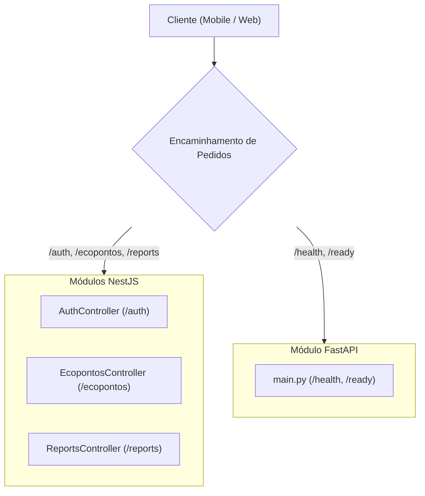

# Diretório de Endpoints

## Table of Contents
- [[API/Auth and Session API]]
- [[API/Citizen Feedback API]]
- [[API/Ecopontos and Routes API]]
- [[API/Analytics Services API]]

## Visão Geral da Arquitetura de APIs

O ecossistema do EcoBairro é servido por duas aplicações distintas de backend que expõem interfaces de programação (APIs) para consumo por clientes web e móveis:

1. **API Principal (NestJS)**: Uma aplicação estruturada sobre o framework NestJS que gere a lógica de negócio central (autenticação de utilizadores, gestão geográfica de ecopontos e submissão de reportes de cidadãos).
2. **Serviço de Analytics (FastAPI)**: Um microsserviço leve desenvolvido em Python (FastAPI) focado no processamento de dados e monitorização de saúde de dependências críticas (como a base de dados PostgreSQL).

Todas as rotas expostas são tipificadas e seguem convenções RESTful para manipulação de recursos. A segurança das comunicações é assegurada através de mecanismos de autenticação baseados em tokens JWT e de limitação de tráfego para prevenção de abusos.

## Índice Global de Endpoints

A tabela abaixo resume os pontos de entrada disponíveis no ecossistema e as suas respetivas políticas de acesso:

| Método | Caminho | Autenticação / Guarda | Descrição |
| :--- | :--- | :--- | :--- |
| **POST** | `/auth/register` | Nenhum (Público) | Registo de novos cidadãos no sistema. |
| **POST** | `/auth/login` | Throttle Limitado | Login de utilizador com credenciais; retorna tokens de acesso. |
| **POST** | `/auth/refresh` | Nenhum / Cookie | Renova o token de acesso através do Token de Atualização. |
| **POST** | `/auth/verify-2fa` | Throttle Limitado | Valida o segundo fator de autenticação para completar o login. |
| **POST** | `/auth/me` | `JwtAuthGuard` | Obtém o perfil do utilizador atualmente autenticado. |
| **POST** | `/auth/forgot-password`| Nenhum (Público) | Inicia o processo de recuperação de palavra-passe. |
| **POST** | `/auth/reset-password` | Nenhum (Público) | Conclui a alteração da palavra-passe com token válido. |
| **POST** | `/auth/verify-email` | Nenhum (Público) | Confirma o endereço de email do utilizador. |
| **POST** | `/auth/resend-verification`| Nenhum (Público) | Reenvia o email de verificação da conta. |
| **POST** | `/auth/logout` | `JwtAuthGuard` | Encerra a sessão atual e invalida os tokens. |
| **GET** | `/ecopontos` | `OptionalJwtAuthGuard`| Lista todos os ecopontos com filtros de estado e zona. |
| **POST** | `/ecopontos` | `JwtAuthGuard` | Cria um novo ecoponto (requer permissão administrativa). |
| **PATCH**| `/ecopontos/:id` | `JwtAuthGuard` | Atualiza metadados ou o estado de sensor de um ecoponto. |
| **DELETE**| `/ecopontos/:id` | `JwtAuthGuard` | Remove logicamente (soft-delete) um ecoponto. |
| **POST** | `/reports` | `JwtAuthGuard` | Submete uma nova ocorrência ou feedback pelo cidadão. |
| **GET** | `/reports/me` | `JwtAuthGuard` | Lista as ocorrências criadas pelo próprio utilizador. |
| **GET** | `/reports/stats` | `JwtAuthGuard` | Obtém estatísticas agregadas de reportes. |
| **GET** | `/reports` | `JwtAuthGuard` | Lista todas as ocorrências registadas (filtros de moderação). |
| **PATCH**| `/reports/:id/status` | `JwtAuthGuard` | Atualiza o estado de resolução de uma ocorrência. |
| **GET** | `/admin/quiz/perguntas` | `JwtAuthGuard` + GESTOR/ADMIN | Lista as perguntas do quiz (vista de gestão, inclui `correta`). |
| **POST** | `/admin/quiz/perguntas` | `JwtAuthGuard` + GESTOR/ADMIN | Cria uma pergunta + opções (2-6, exatamente 1 correta). |
| **PATCH**| `/admin/quiz/perguntas/:id` | `JwtAuthGuard` + GESTOR/ADMIN | Edita a pergunta; `opcoes` (se enviada) substitui todas. |
| **DELETE**| `/admin/quiz/perguntas/:id` | `JwtAuthGuard` + GESTOR/ADMIN | Apaga a pergunta (cascade nas opções). |
| **GET** | `/health` | Nenhum (Público) | Verifica a disponibilidade básica do serviço Analytics. |
| **GET** | `/ready` | Nenhum (Público) | Valida a ligação com a base de dados PostgreSQL. |

---
> **Sources:** apps/api/src/auth/auth.controller.ts:L1-L141, apps/api/src/ecopontos/ecopontos.controller.ts:L1-L103, apps/api/src/reports/reports.controller.ts:L1-L83, apps/analytics/app/main.py:L1-L84

---
*[[index|← Back to Index]] · Generated by repowiki*
