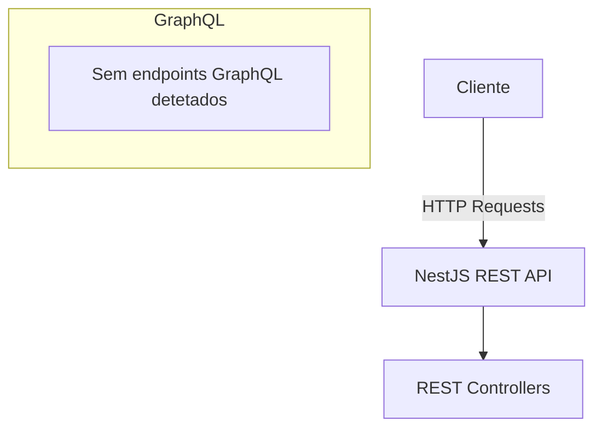

# GraphQL Reference

## Table of Contents
- [[API/REST Endpoints]]
- [[API/API Request & Response Formats]]

## Ausência de Implementação GraphQL

Com base na arquitetura analisada nos módulos fundamentais de utilizadores, reportes e ecopontos, a plataforma EcoBairro está desenhada atualmente com uma forte orientação **RESTful**, através de controladores clássicos e serviços (recurso a `@nestjs/common`).

Nenhuma rota ou *resolver* de GraphQL foi identificado nos ficheiros analisados. 

> **Sources:** `apps/api/src/users/users.controller.ts:L1-L28` · `apps/api/src/reports/reports.controller.ts:L1-L83` · `apps/api/src/ecopontos/ecopontos.controller.ts:L1-L103`

Caso haja intenção de escalar a plataforma para incluir uma interface GraphQL no futuro, será necessário integrar o pacote `@nestjs/graphql` e adaptar a lógica existente que agora recai sobre Data Transfer Objects (DTOs) consumidos através do decorador `@Body()` para *Resolvers* e *Types*.

---
*[[index|← Back to Index]] · Generated by repowiki*
