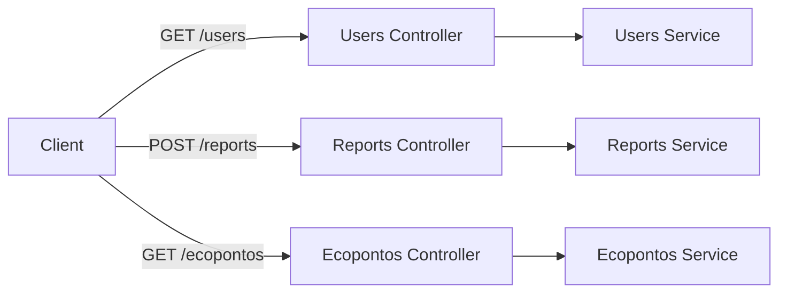

# REST Endpoints

## Table of Contents
- [[API/GraphQL Reference]]
- [[API/API Request & Response Formats]]

## Visão Geral dos Endpoints

A API do sistema EcoBairro segue a arquitetura RESTful, disponibilizando recursos através de controladores. A maior parte das operações requer autenticação baseada em JWT, garantida pelo uso do `JwtAuthGuard` a nível da classe ou do método.

Os principais controladores analisados gerem três domínios principais:
1. **Utilizadores (`/users`)**
2. **Reportes de Ocorrências (`/reports`)**
3. **Ecopontos (`/ecopontos`)**

> **Sources:** `apps/api/src/users/users.controller.ts:L8-L27` · `apps/api/src/reports/reports.controller.ts:L28-L82` · `apps/api/src/ecopontos/ecopontos.controller.ts:L30-L102`

## Endpoints de Utilizadores (`/users`)

O controlador de utilizadores permite listar os utilizadores registados na plataforma.

- `GET /users`: Retorna uma lista paginada de utilizadores. Permite filtragem por `role`, termo de pesquisa (`q`), estado de atividade (`ativo`), além da paginação com `page` e `pageSize`. Requer autenticação JWT.

> **Sources:** `apps/api/src/users/users.controller.ts:L14-L26`

## Endpoints de Reportes (`/reports`)

O domínio de reportes (ocorrências) suporta a criação e visualização de problemas submetidos pelos utilizadores.

- `POST /reports`: Cria um novo reporte submetido pelo utilizador autenticado.
- `GET /reports/me`: Lista todos os reportes submetidos pelo utilizador autenticado, suportando parâmetros de listagem como filtros.
- `GET /reports/stats`: Obtém estatísticas sobre os reportes, baseadas no âmbito (`scope`) e num limite recente (`recentLimit`).
- `GET /reports`: Lista reportes globais (provavelmente para administradores ou mediante a permissão da função do utilizador).
- `PATCH /reports/:id/status`: Atualiza o estado de um reporte específico. Requer passagem do `id` do reporte via UUID.

> **Sources:** `apps/api/src/reports/reports.controller.ts:L37-L81`

## Endpoints de Ecopontos (`/ecopontos`)

O domínio de ecopontos possibilita tanto consultas públicas como gestão privada dos pontos de reciclagem.

- `GET /ecopontos`: Lista ecopontos com vários filtros de pesquisa. Utiliza o `OptionalJwtAuthGuard`, permitindo acesso público, mas possivelmente alterando a resposta se o utilizador estiver autenticado.
  - Parâmetros: `q` (pesquisa livre), `zona` (filtro exato), `codigo_postal` (prefixo), `tipo` (resíduo), `nivel` (ocupação), `todos` (inclui inativos), `page`/`pageSize` (**paginação opt-in**: sem `page` devolve tudo, p/ mapas; com `page` devolve `{ ecopontos, total, page, pageSize }`).
- `GET /ecopontos/zonas`: Devolve `{ zonas: string[] }` (zonas ativas distintas) para o filtro de zona, sem carregar todos os ecopontos.
- `POST /ecopontos`: Regista um novo ecoponto na plataforma (requer JWT).
- `PATCH /ecopontos/:id`: Atualiza dados e/ou o estado dos sensores de um ecoponto existente (requer JWT).
- `DELETE /ecopontos/:id`: Remove (soft-delete) um ecoponto, marcando-o como inativo (requer JWT).

> **Sources:** `apps/api/src/ecopontos/ecopontos.controller.ts:L47-L101`

---
*[[index|← Back to Index]] · Generated by repowiki*
