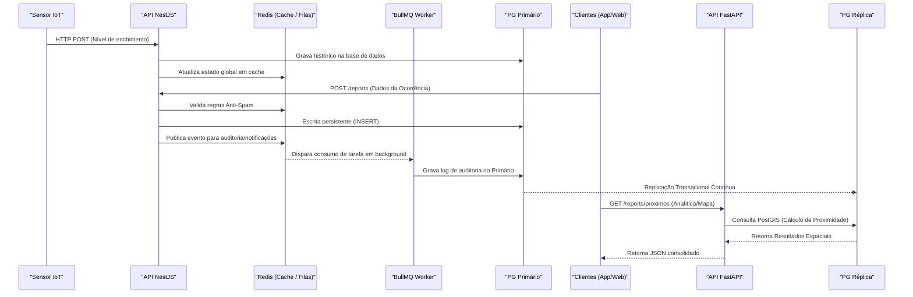

# Data Flow

## Table of Contents
- [[Architecture/System Architecture]]
- [[Architecture/Layered Architecture]]

## Padrões de Fluxo de Dados

O fluxo de dados no EcoBairro Digital baseia-se num padrão simplificado de **CQRS (Command Query Responsibility Segregation)**. As operações transacionais que modificam o estado (escrita) e as consultas de informação (leitura) seguem caminhos distintos e otimizados, garantindo que o sistema responda rapidamente a requisições enquanto processa tarefas complexas em segundo plano.

### 1. Fluxo de Escrita Transacional
Todos os comandos de escrita - como a submissão de reportes pelos munícipes ou o registo de novas equipas de rota pelos gestores - são recebidos pela API Operacional (NestJS) e escritos diretamente na base de dados PostgreSQL primária. Para garantir tempos de resposta reduzidos aos utilizadores, tarefas secundárias não críticas são remetidas para processamento assíncrono.

- **Exemplo de fluxo (`POST /reports`):**
  1. A API verifica a cache Redis para validar os limites de utilizador e intercetar tráfego malicioso (ex: máximo de 2 reportes por utilizador por zona em 24h).
  2. Executa a escrita de forma síncrona no PostgreSQL Primário.
  3. Coloca os eventos de auditoria e de notificação em filas no Redis para serem consumidos pelos *workers* (BullMQ) posterioremente.

### 2. Fluxo Analítico e de Leitura Rápida
Para prevenir que a base de dados primária sofra problemas de contenção causados por consultas pesadas, o Motor Analítico (FastAPI) assume a responsabilidade pelas leituras complexas. Este serviço, direcionado para cálculos matemáticos e agregações PostGIS (como a função `ST_DWithin`), executa as suas *queries* exclusivamente na **Réplica PostgreSQL**, que é atualizada através de replicação nativa.

Leituras rápidas ou dados que mudam com menor frequência (como a contagem global de notificações num determinado instante) são extraídos de forma praticamente instantânea da cache Redis.

### 3. Fluxo de Eventos IoT
A telemetria de sensores instalados fisicamente nos ecopontos utiliza uma aproximação focada em baixa latência e atualização de interface em tempo real:
1. O dispositivo envia regularmente o seu nível de enchimento via `HTTP POST` para a API Operacional.
2. A métrica inserida gera um registo contínuo na tabela de histórico (`leitura_sensor`).
3. O estado atual é gravado numa tabela cache consolidada em menos de 60 milissegundos, para que os mapas do sistema reflitam o estado exato dos ecopontos em tempo quase real para os operadores e cidadãos.

### 4. Fluxo Operacional de Frotas e Rotas
A gestão e condução das recolhas diárias exigem um modelo de dados fortemente interligado na componente espacial e na delegação de papéis.
- O Gestor utiliza o sistema para planear as saídas, associando na base de dados os `operador_perfis` (condutores e assistentes), uma `carrinha` específica e a área de incidência (`zona`), originando o registo de uma `EquipaRota`.
- A plataforma notifica os operadores da atribuição dessa rota.
- Durante a atividade no terreno, as localizações e ecopontos visitados são submetidos gradualmente à API (`PATCH /rotas/:id/concluir`), consolidando o histórico temporal da `RotaExecucao`.

> **Sources:** `docs/06-Arquitetura.md:L57-L74` · `docs/04-Modelo-de-Conceitos.md:L164-L170` · `docs/07-Modelo-de-Dados.md:L49-L55`

---
*[[index|← Back to Index]] · Generated by repowiki*
