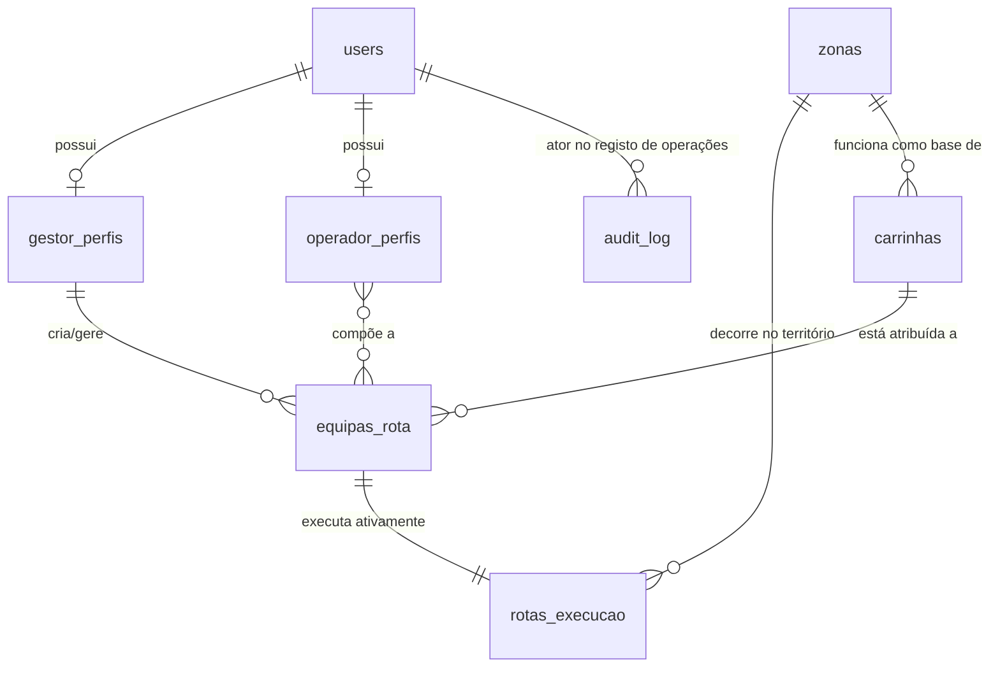

# Layered Architecture

## Table of Contents
- [[Architecture/System Architecture]]
- [[Architecture/Data Flow]]

## Camadas de Domínio Lógico

A estrutura aplicacional do EcoBairro Digital organiza logicamente os seus componentes focando no mapeamento das várias regras de negócio aos serviços em que assentam. O design de alto nível agrupa-se conceptualmente em domínios core, orientando as entidades base em subdomínios independentes e coesos:

1. **Cidadão e Identidade:** Incorpora a camada fundamental de autenticação e de segurança (RBAC). Esta separação define os perfis existentes — `CidadaoPerfil` (munícipe geral), `GestorPerfil` (backoffice da entidade empregadora, responsável pelo planeamento) e `OperadorPerfil` (equipas de terreno com veículos base).
2. **Ecopontos, Zonas, Badges e Quiz:** Camada orientada ao espaço geográfico e gamificação. Foca-se em relacionar polígonos geográficos no plano físico às dinâmicas de fidelização social (badges obtidos pela partilha de monos e quiz educativo).
3. **IoT e Dispositivos:** O módulo tecnológico que trata de traduzir a informação recebida pelo hardware implementado na rua em instâncias lógicas de dados, associando cada dispositivo ao seu recetáculo.
4. **Operacional e Relatório:** O domínio transacional do sistema onde convergem reportes ativos de anomalias por munícipes e a gestão interligada da força de trabalho dos operadores nas estradas.

## Relacionamentos na Camada Operacional

Para ilustrar o acoplamento da camada de dados nesta arquitetura, o modelo de gestão operacional introduz a segregação de responsabilidades no momento de planear as saídas. Ao invés da rota ser assinalada de forma singular a um condutor, introduziu-se conceptualmente a **EquipaRota**.

O diagrama abaixo traduz esta separação lógica. Uma entidade de equipa centraliza os vários operadores, interliga a `Carrinha` associada, e associa tudo a uma área do território.

> **Sources:** `docs/04-Modelo-de-Conceitos.md:L155-L162` · `docs/07-Modelo-de-Dados.md:L33-L58`

## Camada de Auditoria e Conformidade

Atravessando transversalmente todo o sistema operacional, existe uma **camada de auditoria dedicada** (`AuditLog`). Trata-se de um modelo que suporta retenção rígida imposta pelos requisitos de segurança não-funcionais, gravando a alteração de estados da infraestrutura sem degradar a performance final da aplicação, através de fluxos geridos de forma *append-only* pelos *workers*.

> **Sources:** `docs/04-Modelo-de-Conceitos.md:L117-L122` · `docs/06-Arquitetura.md:L65-L65`

---
*[[index|← Back to Index]] · Generated by repowiki*
