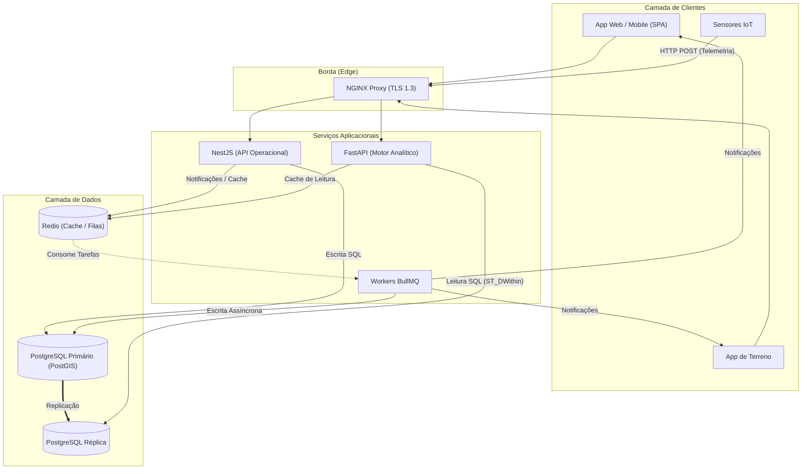

# System Architecture

## Table of Contents
- [[Architecture/Data Flow]]
- [[Architecture/Layered Architecture]]

## Visão Geral do Sistema

O EcoBairro Digital adota uma arquitetura distribuída baseada em componentes especializados, projetada para separar as operações transacionais (escrita) das operações analíticas (leitura). A infraestrutura assenta num gateway na borda, serviços aplicacionais divididos por propósito, e uma camada de dados robusta com replicação.

Esta abordagem permite que o sistema escale horizontalmente e garanta alta disponibilidade, especialmente para o processamento assíncrono de eventos IoT e requisições pesadas de mapas georreferenciados.

## Componentes Principais

### Clientes e Borda
- **App Web / Mobile (Vite + React + TanStack):** Interface para cidadãos e gestores, construída como Single Page Application (SPA).
- **App de Terreno:** Aplicação dedicada aos operadores para visualização da rota do dia e registo de visitas.
- **Sensores IoT:** Dispositivos instalados nos ecopontos que comunicam os níveis de enchimento via telemetria.
- **NGINX:** Atua como proxy reverso na borda, lidando com terminação TLS 1.3 e roteamento inicial das requisições.

### Serviços Aplicacionais
- **NestJS (API Operacional):** Responsável por toda a **escrita** no sistema. Lida com autenticação, Role-Based Access Control (RBAC), e serve como gateway HTTP POST para os sensores IoT.
- **FastAPI (Motor Analítico):** Responsável pela **leitura** pesada e análise de dados. Processa pesquisas georreferenciadas de proximidade (ex: `ST_DWithin`), métricas de desempenho (KPIs), e sugestões algorítmicas de rotas.
- **Workers (BullMQ):** Consumidores de filas de trabalho assíncronas para tarefas secundárias como envio de notificações (Push/Email/SMS), distribuição de dados, e registo de logs de auditoria.

### Camada de Dados
- **PostgreSQL (Primário):** Base de dados relacional principal que inclui a extensão PostGIS para dados geográficos. Recebe todas as operações de escrita provindas do NestJS e dos *Workers*.
- **PostgreSQL (Réplica):** Base de dados sincronizada apenas para leitura, usada exclusivamente pelo FastAPI para consultas analíticas complexas, aliviando o banco primário.
- **Redis:** Atua como cache em memória ultrarrápido, sistema anti-spam (controlo de limites), e intermediário (broker) de mensagens e filas para as tarefas do BullMQ.

> **Sources:** `docs/06-Arquitetura.md:L7-L55`

---
*[[index|← Back to Index]] · Generated by repowiki*
