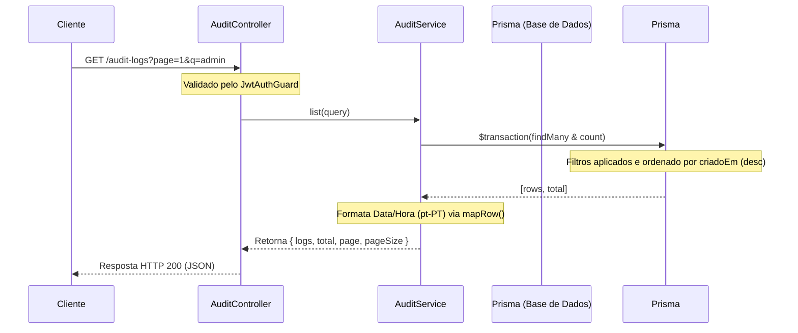

# Logs de Auditoria

## Visão Geral

O módulo de auditoria é responsável por registar de forma centralizada e imutável os eventos críticos e ações realizadas na plataforma. O seu principal objetivo é assegurar a rastreabilidade das operações de utilizadores, providenciando transparência em atividades de segurança como login e logout, bem como noutras alterações no sistema. 

O módulo compõe-se num controlador principal para consultas (`AuditController`) e num serviço de lógica de negócio e persistência (`AuditService`).

> **Sources:** `apps/api/src/audit/audit.controller.ts:L6-L18`, `apps/api/src/audit/audit.service.ts:L44-L108`

## Arquitetura e Fluxo de Leitura

O acesso aos registos de auditoria é feito pelo endpoint `GET /audit-logs`. Este endpoint é rigorosamente protegido e necessita de um token JWT válido, cuja verificação é efetuada pelo `JwtAuthGuard` detalhado em `[[Security/Authentication Flow]]`.

Ao consultar os registos, o controlador encaminha a parametrização para o serviço que processa:
- **Paginação:** São apresentados 50 registos por página, a menos que o utilizador especifique um valor diferente e válido.
- **Filtros por Ação:** Podem ser listadas ações específicas. Como atalho, o filtro `login_logout` devolve ambas as ações de autenticação, facilitando investigações.
- **Pesquisa em Texto Livre (`q`):** Efetua uma busca em modo ignorar-maiúsculas (`mode: 'insensitive'`) baseada nos campos `utilizador` ou `descricao`.

> **Sources:** `apps/api/src/audit/audit.controller.ts:L14-L17`, `apps/api/src/audit/audit.service.ts:L51-L88`

## Registo de Novos Eventos (Escrita)

A gravação de novos eventos de auditoria ocorre através do método interno `write` do serviço `AuditService`. Isto não se encontra exposto via API, mas serve de utilitário para que os outros módulos da aplicação possam auditar as suas próprias operações.

Cada registo requer o nome ou email de quem iniciou a ação (`utilizador`), os seus privilégios no momento (`papel`), a própria `acao` e uma `descricao` humana. Opcionalmente, pode ser fornecido o endereço IP. Como salvaguarda de segurança, se o endereço de IP estiver em falta, o sistema aplica uma predefinição conservadora de `0.0.0.0`. 

Os dados são armazenados na entidade `AuditLog` mapeada no Prisma (ver mais no esquema em `[[Database/Schema Overview]]`).

> **Sources:** `apps/api/src/audit/audit.service.ts:L90-L106`

---
*Voltar à página inicial:* `[[index]]`
