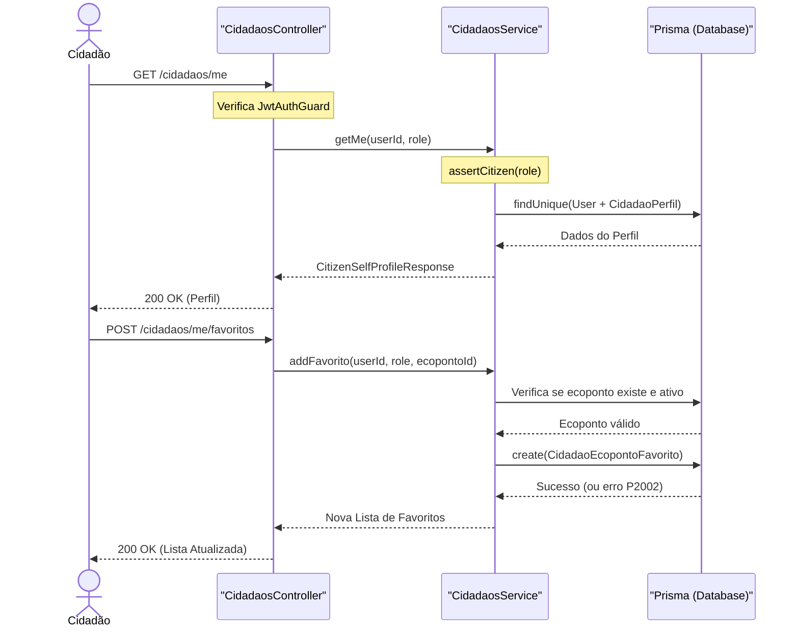

# Perfil do Cidadão

## Table of Contents
- [[Cidadaos/Perfil do Cidadão]]

## Visão Geral

O módulo de **Gestão de Cidadãos** é responsável por gerir o perfil e as preferências dos utilizadores com a função (role) de `CIDADAO`. Este módulo permite aos cidadãos visualizar e editar a sua informação pessoal, bem como gerir a sua lista de ecopontos favoritos na plataforma EcoBairro. Apenas utilizadores autenticados com o perfil de cidadão podem aceder a estas funcionalidades, garantido pelo uso de guardas de autenticação JWT e validação rigorosa da função de utilizador em cada pedido.

## Funcionalidades Principais

As operações são expostas através do `CidadaosController` (`/cidadaos`) e a lógica de negócio está centralizada no `CidadaosService`. 

### Gestão do Perfil Pessoal
Os cidadãos podem consultar os dados do seu próprio perfil através do endpoint `GET /cidadaos/me`. O perfil retornado inclui informações de base (email, telemóvel) geridas na entidade `User`, e dados específicos do cidadão, como o nome completo, consentimento para gamificação, preferências de notificação e configuração de widgets no painel principal (armazenados como JSON), através da entidade `CidadaoPerfil`. 

A atualização do perfil (`PUT /cidadaos/me`) é realizada através de uma transação na base de dados (`$transaction` no Prisma) de forma a garantir a consistência ao atualizar as duas tabelas (`User` e `CidadaoPerfil`) em simultâneo.

### Ecopontos Favoritos
Os utilizadores podem adicionar os seus ecopontos mais utilizados a uma lista de favoritos para acesso rápido no painel ou na aplicação.
- **Listar Favoritos (`GET /cidadaos/me/favoritos`)**: Retorna a lista de todos os ecopontos guardados pelo cidadão (entidade `CidadaoEcopontoFavorito`), com a respetiva distância, estado de ocupação e URL do mapa para o Ecoponto. Ecopontos inativos são filtrados e não são devolvidos.
- **Adicionar Favorito (`POST /cidadaos/me/favoritos`)**: Adiciona um novo ecoponto à lista do utilizador. Se o ecoponto já existir na lista, é lançada uma exceção de conflito (erro Prisma `P2002`). Se o ecoponto não existir ou estiver inativo, é devolvido um erro de `NotFoundException`.
- **Remover Favorito (`DELETE /cidadaos/me/favoritos/:ecopontoId`)**: Remove um ecoponto específico da lista de favoritos do utilizador.

## Arquitetura de Dados e Fluxo

O diagrama seguinte ilustra o fluxo de dados e as permissões durante a gestão de favoritos e do perfil do cidadão:

> **Sources:** `apps/api/src/cidadaos/cidadaos.controller.ts:L23-L75` · `apps/api/src/cidadaos/cidadaos.service.ts:L26-L122`

## Considerações de Segurança

- A função utilitária `assertCitizen(role)` é invocada no início de cada método de negócio no `CidadaosService`, garantindo através de uma exceção `ForbiddenException` que a lógica apenas é executada se o JWT provar que o utilizador é um cidadão (`UserRole.CIDADAO`).
- As transações com o `Prisma` são utilizadas ativamente (`$transaction`) sempre que seja necessário modificar entidades em paralelo (por exemplo, `User` e `CidadaoPerfil` em `updateMe`), evitando o perigo de estados inconsistentes na base de dados no caso de falhas num dos passos.
- Perfis que estejam eliminados logica e permanentemente (`eliminadoEm != null`) estão bloqueados e levam a um erro 404 (`NotFoundException`).

---
*[[index|← Back to Index]] · Generated by repowiki*
