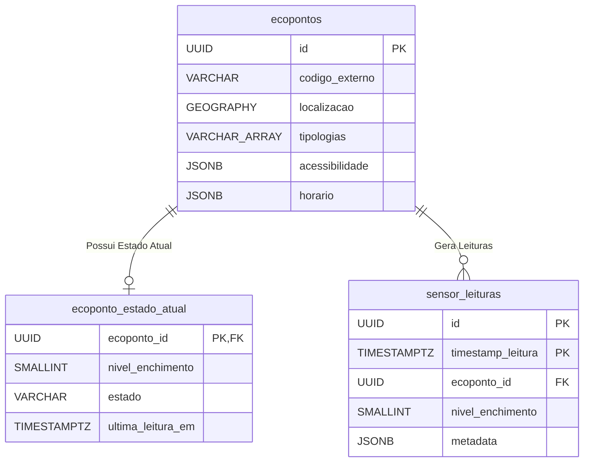
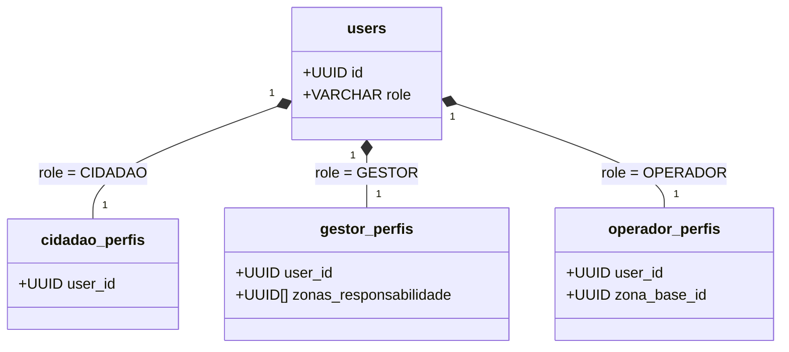

# Models Reference

## Table of Contents
- [[Database/Schema Overview]]
- [[Database/Relationships & Indexes]]
- [[Database/Redis & Caching]]

## Entidades de Infraestrutura: Ecopontos

A infraestrutura dos Ecopontos é gerida por um conjunto de três tabelas que separam a configuração estática, o estado dinâmico recente e o histórico de leituras.

### Tabela: `ecopontos`
Esta é a tabela principal para armazenar a informação descritiva e espacial de cada ecoponto.
- Utiliza `UUID` como chave primária gerada via `gen_random_uuid()`.
- O suporte espacial é garantido pela coluna `localizacao` do tipo `GEOGRAPHY(POINT,4326)`.
- As categorias de resíduos são mantidas num array `tipologias` (e.g., `VIDRO`, `PAPEL`, `PLASTICO`).
- Detalhes adicionais como acessibilidade (rampa, cobertura) e horários são persistidos num formato flexível através do tipo `JSONB`.
- A `zona` é uma **etiqueta de texto derivada automaticamente** da localização (`lat`/`lng`) por clustering de proximidade (raio 50 m) — **não** existe tabela `zonas` nem FK `zona_id`. Ver `apps/api/src/ecopontos/zona.helper.ts`.

### Tabela: `ecoponto_estado_atual`
Tabela denormalizada desenhada especificamente para reter apenas uma linha por cada ecoponto, sendo constantemente atualizada pelos sensores IoT.
- Grava o `nivel_enchimento` e o `estado` (ex: `CHEIO`, `DISPONIVEL`, `AVARIADO`).
- É a principal fonte para as queries em tempo real de mapas e monitorização.

### Tabela: `sensor_leituras`
Tabela otimizada para inserções de alto débito provenientes dos dispositivos IoT.
- Regista o nível de enchimento reportado em cada timestamp.
- Armazena métricas de rede e hardware do sensor em formato `JSONB` na coluna `metadata` (bateria, sinal, temperatura).

> **Sources:** `docs/models/Ecopontos, Zonas, Badges e Quiz/ecopontos/base de dados/2.2 Schema PostgreSQL — Ecopontos.md:L3-L79`

## Entidades de Utilizadores e Perfis

O ecossistema divide os perfis em tabelas de extensão exclusivas, acedidas a partir da tabela raiz `users`:
- `cidadao_perfis`: Contém as preferências e associações a zonas residenciais.
- `gestor_perfis`: Define as `zonas_responsabilidade` geridas por um Administrador ou Gestor.
- `operador_perfis`: Define as informações específicas da equipa de recolha, incluindo a ligação às viaturas via `equipas_rota`.

> **Sources:** `docs/models/Cidadão/base de dados/2.8 Mapa de relacionamentos.md:L4-L22`

---
*[[index|← Back to Index]] · Generated by repowiki*
