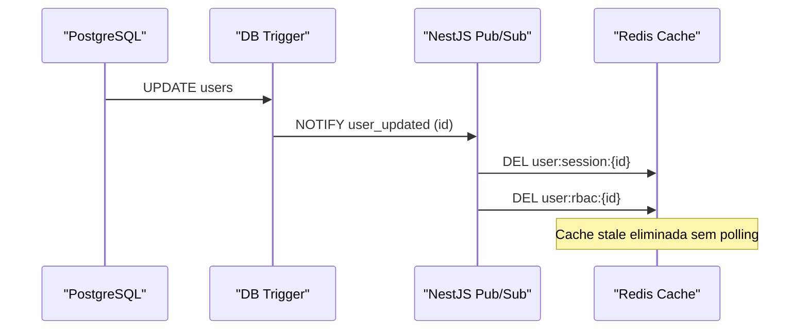
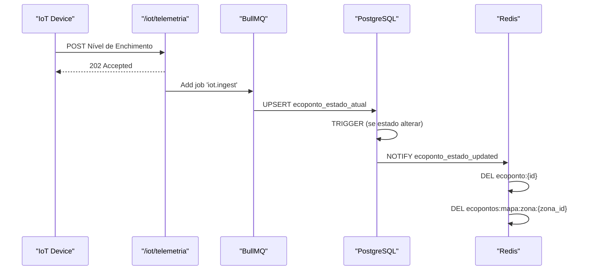

# Redis & Caching

## Table of Contents
- [[Database/Schema Overview]]
- [[Database/Models Reference]]
- [[Database/Relationships & Indexes]]

## Estratégia de Caching Reactiva

A arquitetura de cache do Ecobairro no Redis rejeita a habitual abordagem baseada apenas em TTL longo ou em curtos períodos de polling agressivo. O sistema baseia-se num **pipeline LISTEN/NOTIFY reativo do PostgreSQL** acoplado ao NestJS (via `nestjs-pg-pubsub`) para garantir a invalidação imediata e granular dos dados guardados em cache, permitindo tempos de expiração (TTL) adequados ou invalidação proativa quando ocorrem mutações na base de dados.

### Caching de Sessão e Perfis
O armazenamento no Redis divide-se em chaves de curta e média duração com uma gestão cuidada de nomenclatura.
1. **Identidade:** `user:session:{user_id}` (15 min, com sliding) e `user:rbac:{user_id}` (5 min). O RBAC é considerado crítico e tem o seu próprio TTL curto, para além de poder ser limpo por eventos de alteração de privilégios.
2. **Cidadãos:** Inclui `cidadao:profile:{user_id}`, `cidadao:notif_prefs:{user_id}`, e até estado de gamificação em `cidadao:gamif:{user_id}`.
3. **Mecanismos Anti-Spam:** A chave `antispam:report:{user_id}:{zona}` atua como contador atómico que utiliza o comando `INCR` para impor limites à submissão de reports durante 24 horas.

> **Sources:** `docs/models/Cidadão/base de dados/3.2 Redis — cache e operações rápidas.md:L1-L98`

## Caching de Alta Frequência IoT

A telemetria dos Ecopontos introduz um desafio único devido ao volume das alterações de estado. A atualização do mapa tem que ser rápida (sub 2 segundos), sendo os TTLs de IoT curtos por natureza.

### Chaves de Ecopontos
- `ecoponto:{id}` (TTL: 2 min) mantém o objeto e estado unificados.
- `ecopontos:mapa:zona:{zona_id}` (TTL: 2 min) guarda o array completo da zona para renderização instantânea do mapa (o "Hot Path" de leitura).

### Ingestão de Telemetria e Alertas
O fluxo de ingestão de telemetria baseia-se numa stack desacoplada utilizando BullMQ e gatilhos de base de dados para sincronizar o Redis com a PostgreSQL.

1. **Recepção:** A API de telemetria responde rapidamente (202 Accepted) aos sensores e delega o processamento ao BullMQ.
2. **Persistência:** O job faz append em `sensor_leituras` e um "UPSERT" em `ecoponto_estado_atual`.
3. **Notificação de Estado:** Se o estado mudar (por exemplo, de "DISPONIVEL" para "CHEIO"), o trigger no PostgreSQL emite o evento `ecoponto_estado_updated`.
4. **Sincronização & Alertas:** O NestJS intercepta a notificação e remove imediatamente os dados antigos (`ecoponto:{id}` e o mapa da `zona_id`) do Redis. Ao mesmo tempo, caso o contentor reporte "CHEIO", outro job no BullMQ pode despachar o envio de alertas por SMS, push ou email ao operador responsável.

> **Sources:** `docs/models/Ecopontos, Zonas, Badges e Quiz/ecopontos/base de dados/2.2 Schema PostgreSQL — Ecopontos.md:L124-L167`

---
*[[index|← Back to Index]] · Generated by repowiki*
