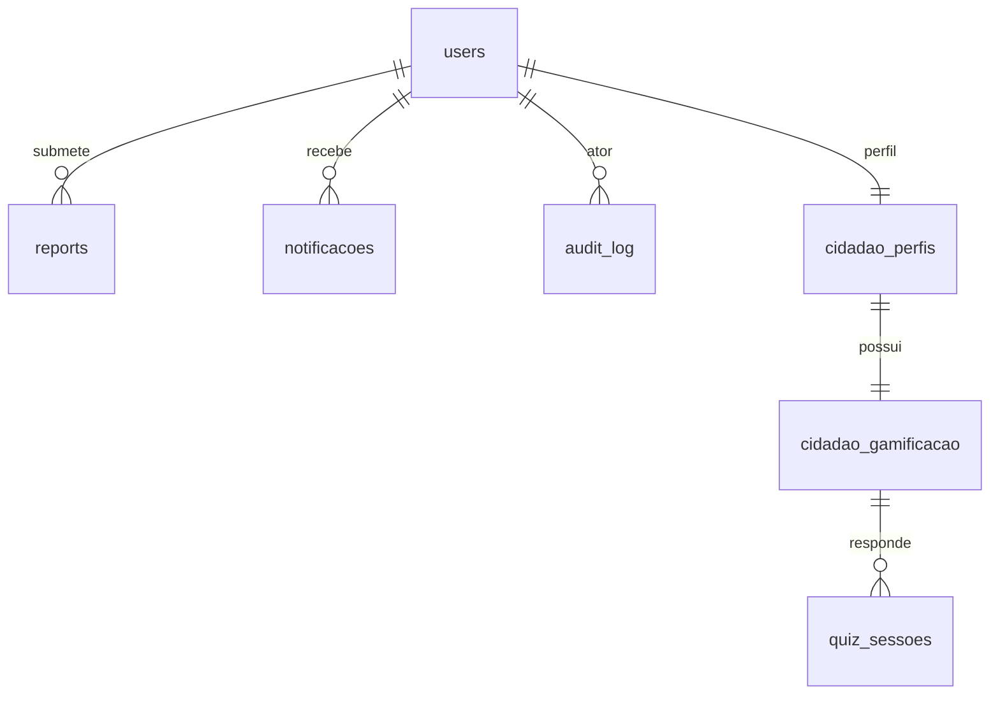
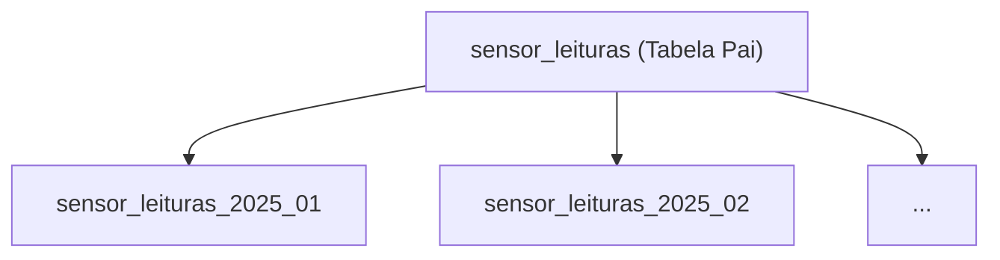

# Relationships & Indexes

## Table of Contents
- [[Database/Schema Overview]]
- [[Database/Models Reference]]
- [[Database/Redis & Caching]]

## Estratégias de Relacionamento e FKs

As ligações entre tabelas no Ecobairro priorizam a centralidade da identidade do utilizador e as abstrações geográficas.
1. **Centralização no User**: Entidades como `reports`, `pedidos_recolha`, `notificacoes`, `partilhas_materiais`, e registos de `audit_log` estão todas diretamente relacionadas a `users(id)`. Mesmo que as colunas sejam designadas como `cidadao_id`, o alvo da FK é a tabela `users`.
2. **Gamificação**: O perfil do cidadão tem uma relação `1:1` com `cidadao_gamificacao`. A partir daqui, estendem-se relações `1:N` para `quiz_sessoes` e `N:M` para `badges`.
3. **Gestão de Frotas**: A ligação entre o operador e a rota é feita através da tabela de intersecção `equipas_rota`, que por sua vez se relaciona de modo `1:1` com `rotas_execucao`.

> **Sources:** `docs/models/Cidadão/base de dados/2.8 Mapa de relacionamentos.md:L23-L47`

## Particionamento de Dados IoT

A ingestão das métricas dos ecopontos cresce a um ritmo elevado (aprox. 10.000 mensagens por minuto), exigindo uma abordagem de tabela particionada para a `sensor_leituras`.
- **Estratégia:** Particionamento por `RANGE` sobre a coluna `timestamp_leitura`.
- **Gestão:** Mensalmente, o `pg_partman` cria as partições dos meses seguintes e retira (detach) as partições antigas. O ciclo de vida máximo estipulado é de 24 meses, após os quais a partição entra em DROP.

## Índices e Optimização

A escolha de índices é cirúrgica, ajustada aos requisitos de leitura e volume de dados do sistema.

### Índices Geográficos e Complexos
- **`ecopontos.localizacao`**: Utiliza um índice `GIST`. Extremamente crítico para operações espaciais como o `ST_DWithin`, essencial para a funcionalidade de "mostrar ecopontos perto de mim" (RNF-PERF-02).
- **`ecopontos.tipologias`**: Recorre a um índice `GIN` para permitir filtragem rápida pelos tipos de material aceites em cada contentor.
- **`gestor_perfis.zonas_responsabilidade`**: Utiliza índice `GIN` no array de UUIDs.

### Índices BTREE Parciais
- Em `ecopontos`, a coluna `zona` é uma **etiqueta de texto derivada por proximidade** (50 m), não uma FK `zona_id`; um índice parcial combinado de `zona` e `ativo = true` acelera a filtragem/renderização do mapa por zona.
- Em `sensor_leituras`, para prevenir o varrimento total, utiliza-se um BTREE Parcial na condição `nivel_enchimento >= 80`, ajudando assim o motor de alertas a detetar contentores em overflow.

### BRIN Index para Séries Temporais
Na tabela `sensor_leituras`, a coluna `timestamp_leitura` é indexada com `BRIN` (Block Range Index). Tendo em conta o volume formidável de inserções sequenciais e o facto de a maioria das pesquisas ser efetuada em blocos temporais contínuos, um `BTREE` consumiria gigabytes de memória. O `BRIN`, sendo altamente comprimido (~100KB), proporciona o rácio perfeito de desempenho de pesquisa versus uso de RAM para leituras de séries temporais.

> **Sources:** `docs/models/Ecopontos, Zonas, Badges e Quiz/ecopontos/base de dados/2.2 Schema PostgreSQL — Ecopontos.md:L81-L122`

---
*[[index|← Back to Index]] · Generated by repowiki*
