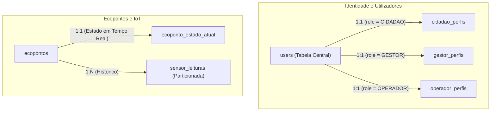

# Schema Overview

## Table of Contents
- [[Database/Models Reference]]
- [[Database/Relationships & Indexes]]
- [[Database/Redis & Caching]]

## Arquitetura Geral da Base de Dados

A base de dados do projeto Ecobairro está estruturada para suportar múltiplos domínios de negócio, centrando-se na separação clara de responsabilidades entre as entidades fundamentais. O modelo relacional assegura a integridade referencial ao mesmo tempo que suporta operações geoespaciais e ingestão de alto débito para telemetria.

Os dois eixos centrais do modelo de dados são:
1. **Gestão de Identidade e Perfis:** Centralizada na tabela `users`, que atua como âncora para os diversos perfis do sistema, nomeadamente o Cidadão, Gestor/Administrador e Operador.
2. **Gestão de Infraestrutura e IoT:** Liderada pela tabela `ecopontos`, que agrupa tanto os metadados estáticos do contentor como a sua localização e as leituras de telemetria particionadas que provêm dos sensores IoT.

> **Sources:** `docs/models/Cidadão/base de dados/2.8 Mapa de relacionamentos.md:L1-L22` · `docs/models/Ecopontos, Zonas, Badges e Quiz/ecopontos/base de dados/2.2 Schema PostgreSQL — Ecopontos.md:L1-L94`

## Abordagem de Identidade

No domínio do Cidadão e Utilizadores, o design consolidou as chaves estrangeiras. Anteriormente existia uma referência direta à entidade cidadão, mas a arquitetura foi refatorada para que todas as referências apontem para `users(id)`. Apesar disto, as colunas nas tabelas dependentes ainda retêm nomes semânticos como `cidadao_id` ou `actor_id`. A partir do `user`, a relação deriva para o perfil correspondente através da verificação da coluna `role`.

---
*[[index|← Back to Index]] · Generated by repowiki*
