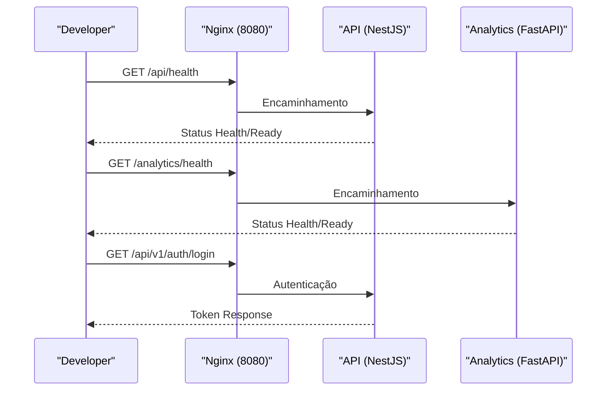

# API Debugging

## Table of Contents
- [[FAQ/Common Issues]]
- [[FAQ/Deployment Troubleshooting]]

## Diagnóstico e Endpoints de Estado da API

O ecossistema divide-se principalmente em três superfícies principais: a aplicação central no NestJS (`apps/api`) que aborda a primeira fase de autenticação e a gestão de perfis de cidadão, um microsserviço de Analytics (`apps/analytics`) usando FastAPI e um frontend em `apps/web`.

Para a validação e o diagnóstico do comportamento do backend local, foram implementadas várias *health surfaces* (superfícies de saúde). Quando as APIs encontram falhas, o primeiro passo no *debugging* deve ser sempre validar estes endereços base. Tanto a `api` primária quanto o microsserviço de `analytics` contêm *endpoints* de `/health` e `/ready`.

> **Sources:** `README.md:L84-L101`

## Ferramentas para Depuração Adicional

Se os terminais de prontidão devolverem respostas de sucesso e as operações de gestão contínua de recursos (como `/api/v1/cidadaos/me` ou o refresh do `/api/v1/auth/refresh`) falharem, deve isolar a análise aos serviços de aplicação, acedendo diretamente ao ficheiro de logs dedicado do módulo, limitando o ruído no terminal. A API primária expõe o prefixo `/api/v1/auth` e serve de ponte para a base de dados central que implementa lógica da fase 1. Testes unitários também são um bom primeiro passo para verificar uma nova alteração de backend. O runtime de testes do backend pode ser corrido usando o comando de test da `apps/api`.

> **Sources:** `README.md:L33-L39` · `README.md:L95-L99`

---
*[[index|← Back to Index]] · Generated by repowiki*
