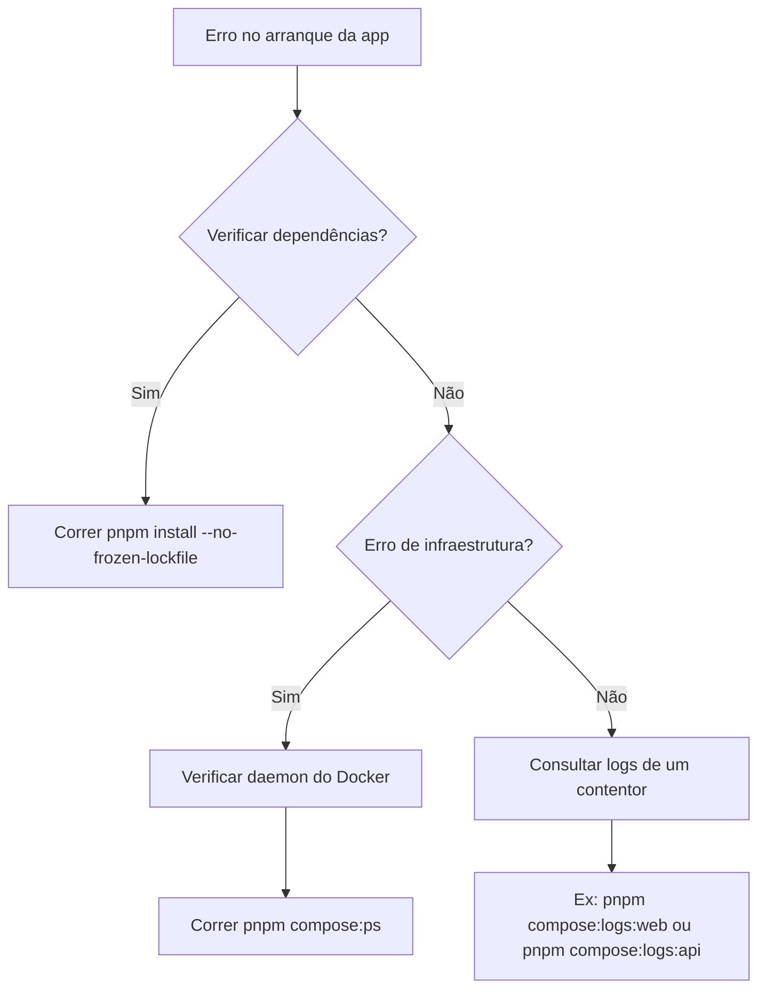

# Common Issues

## Table of Contents
- [[FAQ/Deployment Troubleshooting]]
- [[FAQ/API Debugging]]

## Resolução de Problemas Comuns

Ao iniciar a plataforma **EcoBairro** localmente, a maioria dos problemas comuns está relacionada com a configuração do Docker ou com a instalação das dependências via `pnpm`. A secção de pré-requisitos estabelece a necessidade do Docker Desktop (ou um daemon local) e do Node.js com `pnpm` ativo através do Corepack.

Se ocorrerem erros de dependências locais, garanta que a instalação não está bloqueada num estado inconsistente usando a flag `--no-frozen-lockfile`. 

Para identificar rapidamente a causa raiz de um serviço que não arranca, a plataforma disponibiliza comandos de logs agregados ou direcionados, assim como uma listagem rápida do estado atual dos contentores.

> **Sources:** `README.md:L18-L37`

## Fluxo de Trabalho Recomendado no Terminal

Para manter o fluxo contínuo e evitar problemas durante o desenvolvimento:
1. Mantenha sempre o Docker Compose a correr em modo *detached* para evitar bloquear a sua shell.
2. Observe os logs globais apenas para obter uma visão geral, preferindo os comandos específicos para logs das áreas em que está a trabalhar (ex: logs para o NestJS ou frontend).
3. Acompanhe o estado da *stack* rapidamente usando o comando de `ps`.

> **Sources:** `README.md:L55-L62`

---
*[[index|← Back to Index]] · Generated by repowiki*
