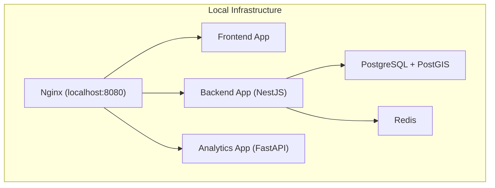

# Deployment Troubleshooting

## Table of Contents
- [[FAQ/Common Issues]]
- [[FAQ/API Debugging]]

## Resolução de Problemas no Deployment Local

O deployment e o bootstrap do runtime local dependem inteiramente do Docker Compose. A stack inclui contentores para a aplicação `web`, para a aplicação `api` e para `analytics`, bem como serviços de base de dados essenciais como PostgreSQL (com extensão PostGIS) e Redis. Adicionalmente, um Nginx orquestra o encaminhamento através de prefixos para uma porta única.

Se um serviço não arrancar, é aconselhável realizar a verificação do daemon Docker local e forçar a recriação da infraestrutura, reiniciando completamente a *stack*. O Nginx concentra todo o tráfego de entrada em `http://localhost:8080`, simplificando a descoberta das falhas.

> **Sources:** `README.md:L13-L15` · `README.md:L78-L82`

## Procedimentos de Setup e Migrações

A ordem de arranque durante a instalação inicial afeta o ambiente. O deployment correto deve seguir rigorosamente estes passos para evitar erros locais, especialmente relacionados à base de dados. As migrações devem ser aplicadas ao backend apenas depois da subida local da stack.

1. Assegure a cópia de valores iniciais copiando o ficheiro `.env.example` para `.env`.
2. Garanta a correta orquestração do compose via `pnpm compose:up`.
3. Aplique diretamente as migrações no contentor associado à aplicação de backend NestJS, que atualiza a estrutura do PostGIS/PostgresSQL usando `pnpm --dir apps/api exec prisma migrate deploy`.

> **Sources:** `README.md:L41-L54`

---
*[[index|← Back to Index]] · Generated by repowiki*
