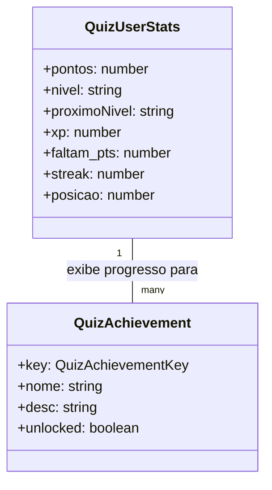

# Gamification Rewards

## Table of Contents
- [[Finance/Payments Architecture]]
- [[Finance/Transaction Flow]]

## Sistema de Recompensas

O sistema de gamificação visa incentivar os cidadãos a participarem ativamente na comunidade, seja reportando problemas ou realizando partilhas. O núcleo deste sistema é gerido pelo `GamificationController` e `GamificationService`, que expõem um endpoint focado no cidadão: `GET /gamification/quiz/me`. 

A gamificação baseia-se em cálculos dinâmicos em vez de persistir transações estáticas de pontos. A pontuação atual de um utilizador é calculada em tempo real com base nas suas ações resolvidas e partilhadas. Apenas utilizadores com o cargo de `CIDADAO` têm permissão para aceder a este mecanismo.

### Cálculo de Pontos e Níveis

Os pontos são o principal indicador de progresso e são atribuídos através das seguintes regras de negócio:
- **Reportes Resolvidos**: Cada reporte com o estado `RESOLVIDO` concede 100 pontos.
- **Partilhas**: Cada partilha efetuada concede 50 pontos.
- **Quiz**: Cada sessão de quiz concluída soma o `scoreObtido` (pontos por
  pergunta, default 10) ao total — `pontos = reports*100 + partilhas*50 + Σ score`.

Com base nesta pontuação, os utilizadores progridem em diferentes escalões. A transição exige atingir determinados marcos quantitativos:
- `Iniciante` (< 500 pontos)
- `Eco-Guerreiro` (500 a 999 pontos)
- `Guardião Verde` (1000 a 1499 pontos)
- `Eco-Guardiões` (1500 a 1999 pontos)
- `Líder da Reciclagem` (≥ 2000 pontos)

A experiência de gamificação também contempla desafios periódicos (`QuizDesafio`), que definem o tempo limite de resposta e eventuais bónus de XP do período atual.

### Quiz jogável (RF-19)

O quiz é totalmente funcional: o cidadão (com opt-in ativo) inicia uma sessão,
responde a perguntas sobre lixo/reciclagem e recebe feedback educativo. As
perguntas são **sorteadas aleatoriamente** (Fisher-Yates, `quiz-random.util.ts`)
de um **banco curado** PT-PT (`apps/api/prisma/quiz-bank.ts`, seedado como pool
`Quiz`) — não há geração por LLM/ML em runtime. A sessão vive em
`Redis quiz:sessao:{id}` (TTL 30 min) e a opção `correta` nunca é enviada ao
cliente antes do resultado. Endpoints: `POST /gamification/quiz/iniciar`,
`POST /gamification/quiz/sessao/:id/responder`, `GET /gamification/quiz/historico`,
`POST|DELETE /gamification/optin`. Detalhe em `apps/api/src/gamification/CLAUDE.md`.

> **Sources:** `apps/api/src/gamification/gamification.service.ts:L53-L64` · `apps/api/src/gamification/gamification.service.ts:L108-L116`

### Gestão de perguntas (GESTOR/ADMIN)

Para além do jogo (cidadão), o **gestor e o admin** gerem o banco de perguntas
em runtime via `QuizAdminController` (`@Controller('admin/quiz')`):
`GET/POST/PATCH/DELETE /admin/quiz/perguntas`. O acesso é garantido no service
(`QuizAdminService.assertManager` → `GESTOR` ou `ADMIN`), com auditoria
best-effort. Regras: 2-6 opções e **exatamente 1 correta** por pergunta
(`validateOpcoes`); a `ordem` da nova pergunta é `max+1` no pool ativo. Esta
vista de gestão **expõe `correta`** (ao contrário do jogo). Editar uma pergunta
substitui as suas opções numa transação — não corrompe o histórico, porque
`quiz_sessoes.respostas` faz snapshot de `opcaoId`/pontos. O seed do banco passou
a ser *create-if-absent*, preservando perguntas adicionadas pelo gestor. UI:
`apps/web/src/routes/_layoutmain.gestao-quiz.tsx`.

> **Sources:** `apps/api/src/gamification/quiz-admin.controller.ts` · `apps/api/src/gamification/quiz-admin.service.ts`

## Conquistas e Desafios

Os utilizadores também podem desbloquear *achievements* (conquistas) específicos, que avaliam não só o volume de pontos, mas também a consistência e diversidade da sua atividade diária:
- **Eco-Sábio**: Requer 10 quizzes "perfeitos" (todas as respostas certas) consecutivos, a partir da sessão mais recente (`computeQuizWinStreak`).
- **Olho Vivo**: Desbloqueado no primeiro reporte que atinja o estado de resolvido.
- **Reciclagem Pro**: Baseia-se no volume de resíduos, com um cálculo estimado em 5kg por cada reporte resolvido (exigindo 100kg ou cerca de 20 reportes).
- **Mestre da Rua**: Requer que o utilizador tenha reportes resolvidos em 5 locais (`local`) distintos.
- **Lenda Urbana**: Exclusivo para cidadãos que fiquem nos primeiros 3 lugares no ranking mensal. O ranking mensal restringe a contagem de pontos apenas a reportes e partilhas que decorreram no mês atual em UTC.
- **Benfeitor**: Requer a criação de 5 partilhas independentemente da data.

> **Sources:** `apps/api/src/gamification/gamification.service.ts:L13-L24` · `apps/api/src/gamification/gamification.service.ts:L191-L219`

---
*[[index|← Back to Index]] · Generated by repowiki*
