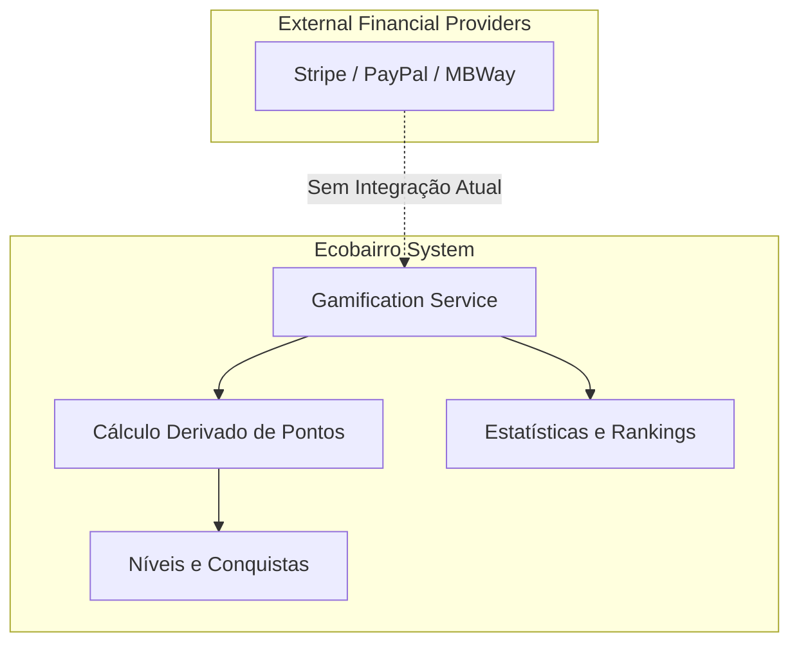

# Payments Architecture

## Table of Contents
- [[Finance/Gamification Rewards]]
- [[Finance/Transaction Flow]]

## Âmbito Financeiro e Limitações

Apesar de se encontrar enquadrado na categoria *Finance*, no atual espetro de funcionalidades expostas pelos controladores e serviços avaliados (`gamification` e `campanhas`), **não existe uma implementação clássica de infraestrutura de pagamentos** (como gateways financeiros, gestão de faturas ou transferências monetárias).

A arquitetura do sistema concentra-se exclusivamente em "moedas sociais" não convertíveis e em dinâmicas de engajamento assentes em gamificação. Nenhum fluxo financeiro fiduciário cruza este serviço até à presente versão.

### Desenho de Recompensas em Tempo Real

A arquitetura compensa os cidadãos unicamente com um sistema de pontuação e atributos. Este design previne os clássicos constrangimentos de atomicidade, consistência, isolamento e durabilidade (ACID) essenciais numa carteira de pagamentos financeira, pois o cálculo das pontuações não mantém histórico transacional de balanços — pelo contrário, a arquitetura recalcula o saldo por inferência das interações do sistema em cada pedido GET.

O processo funciona de forma imutável dependendo do `ReportStatus` originado noutras partes do sistema de informação, assegurando a integridade natural do sistema de pontuação da plataforma sem exigir um motor contábil (ledger).

> **Sources:** `apps/api/src/gamification/gamification.service.ts:L94-L106`

---
*[[index|← Back to Index]] · Generated by repowiki*
