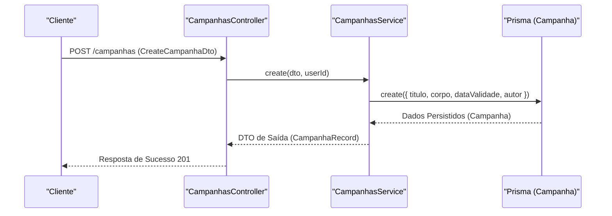
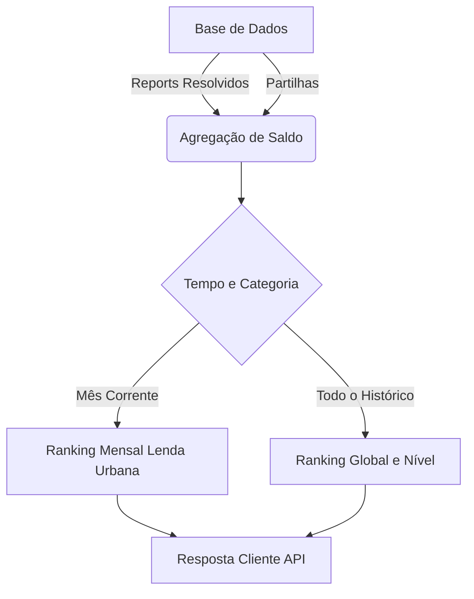

# Transaction Flow

## Table of Contents
- [[Finance/Gamification Rewards]]
- [[Finance/Payments Architecture]]

## Fluxos de Operação de Campanhas

Na arquitetura analisada para os módulos de engajamento, o conceito de "transação" não envolve movimentos cambiais ou processamentos de pagamento, sendo redirecionado para a gestão e fluxos de estado dos dados. O domínio de `Campanhas` (`CampanhasController`) encarrega-se do fluxo estruturado de criação e manutenção de iniciativas ativas no sistema.

O fluxo de informações submete-se a autenticação JWT (`JwtAuthGuard`) e segue um padrão REST previsível:

1. **Criação de Campanha** (`POST /campanhas`): Utilizadores autenticados submetem o payload da campanha. O fluxo de criação identifica a origem do utilizador (procurando o `nomeCompleto` ou um preenchimento derivado do e-mail) e atribui "Câmara de Aveiro" como fallback do autor, caso contrário.
2. **Listagem e Consulta** (`GET /campanhas`): Este endpoint concretiza uma leitura não destrutiva, suportando operações de paginação (`page`, `pageSize`) e filtragem condicional *case-insensitive* por texto livre ou estado.
3. **Atualizações Parciais** (`PATCH /campanhas/:id`): Atualiza condicionalmente campos independentes como título, corpo, prazo de validade e o estado.

> **Sources:** `apps/api/src/campanhas/campanhas.controller.ts:L28-L44` · `apps/api/src/campanhas/campanhas.service.ts:L77-L111`

## Transações de Pontos na Gamificação

Uma faceta adicional da transação de dados ocorre aquando do cálculo contínuo de métricas no sistema de Recompensas (`GamificationService`). O sistema efetua agregações sob a forma de uma conta-corrente virtual sem gravar registos em tabelas transacionais específicas:

1. O balanço do utilizador consulta instâncias com `ReportStatus.RESOLVIDO`.
2. Soma-se um peso matemático fixo para deduzir o saldo ativo (100 por reporte, 50 por partilha).
3. O fluxo isola estatísticas temporais (como o ranking mensal UTC) por oposição a pontuações globais.
4. O desfecho é enviado ao cliente empacotado sob a interface de `QuizMeResponse`.

> **Sources:** `apps/api/src/gamification/gamification.service.ts:L119-L179`

---
*[[index|← Back to Index]] · Generated by repowiki*
