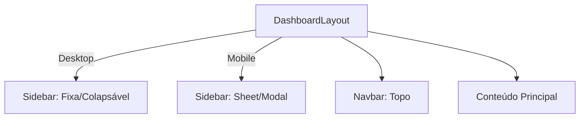
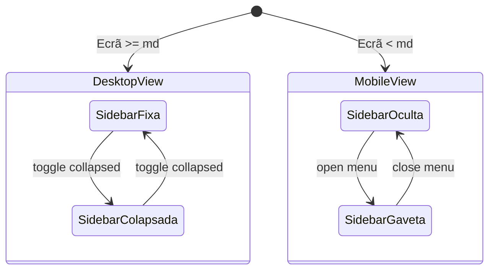

# Component Library

## Table of Contents
- [[Frontend/Frontend Overview]]
- [[Frontend/Routing & Navigation]]

## Dashboard Layout

O `DashboardLayout` atua como o principal invólucro (wrapper) visual para as áreas autenticadas e administrativas da aplicação. A sua estrutura foi desenhada de forma a ser responsiva, adaptando-se perfeitamente tanto a dispositivos móveis como a ambientes de *desktop*.

A disposição do layout é composta por uma *Sidebar* de navegação à esquerda, uma barra de navegação no topo (*Navbar*) e uma área central flexível destinada a renderizar os diferentes módulos (o `children` do React). O layout requer a passagem das informações do utilizador ativo (`user`), usando o seu `role` para adequar as permissões de acesso visual, em especial nas opções da *Sidebar*.

> **Sources:** `apps/web/src/components/layout/DashboardLayout.tsx:L12-L41`

## Comportamento Responsivo e Navegação

Para assegurar uma experiência fluída, o layout adota estratégias visuais diferentes consoante o tamanho do ecrã:

- **Em Ecrãs Desktop (`md` ou superior):** A *Sidebar* encontra-se permanentemente visível, embora possa ser colapsada alternando um estado local (`collapsed`).
- **Em Ecrãs Mobile:** A *Sidebar* fica oculta, sendo acessível através da *Navbar* que desencadeia a abertura de um componente do tipo *Sheet* (uma gaveta deslizante lateral). A sincronização da abertura/fecho desta gaveta móvel é mantida pelo estado `mobileOpen`.

A área de conteúdo principal ocupa sempre o espaço sobrante, com a política de ocultar excedentes transversais (`overflow-hidden` a nível global) limitando assim o *scroll* vertical apenas e especificamente ao bloco `<main>`, mantendo a *Sidebar* e a *Navbar* fixas.

> **Sources:** `apps/web/src/components/layout/DashboardLayout.tsx:L13-L33`

## Paginação de Listas (`PaginationBar` + `useListQuery`)

As páginas de lista que podem exceder 10 itens são paginadas na base de dados e
guardam o estado na URL (`nuqs`). Dois blocos reutilizáveis suportam o padrão:

- **`PaginationBar`** (`apps/web/src/components/ui/pagination-bar.tsx`): barra de
  botões anterior/seguinte + números de página com reticências. Props:
  `{ page, pageCount, onPage }`. Não renderiza nada quando `pageCount <= 1`.
- **`useListQuery`** (`apps/web/src/lib/use-list-query.ts`): hook sobre o `nuqs`
  que mantém `page` + filtros/pesquisa na query string. Devolve
  `{ params, setPage, setFilters, pageSize }`; `setFilters` repõe `page = 1`.
  Detalhes do estado de URL em [[Frontend/State Management Flow]].

Páginas de mapa/agregação (`mapa-sensores`, `rotas`, `zonas`, `analytics`,
`home`) **não** usam este padrão — precisam do conjunto completo de dados.

> **Sources:** `apps/web/src/components/ui/pagination-bar.tsx` · `apps/web/src/lib/use-list-query.ts`

---
*[[index|← Back to Index]] · Generated by repowiki*
