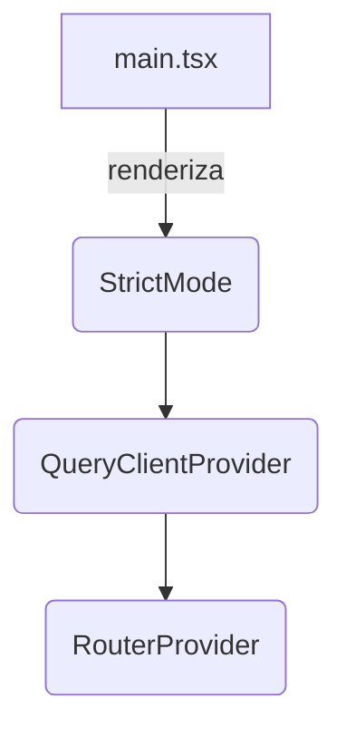
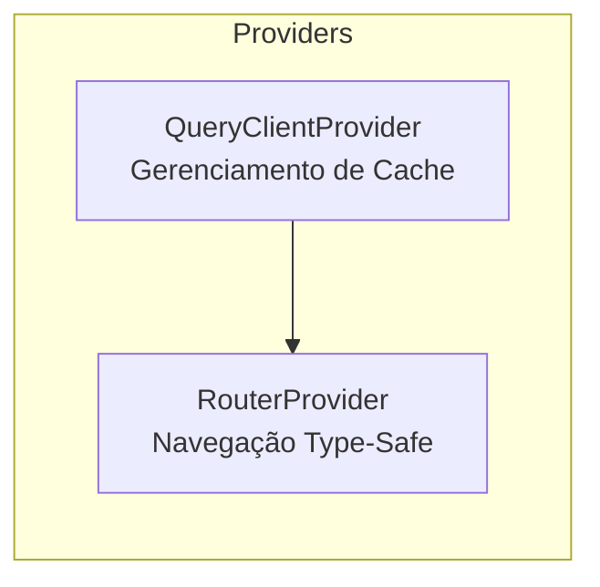

# Frontend Overview

## Table of Contents
- [[Frontend/Component Library]]
- [[Frontend/Routing & Navigation]]

## Ponto de Entrada da Aplicação

A aplicação frontend é desenvolvida utilizando React e estruturada para oferecer alta performance e previsibilidade de estado. O ponto de entrada principal (`main.tsx`) é responsável por configurar o ambiente raiz da aplicação, injetando os *providers* necessários para o correto funcionamento dos componentes subjacentes. 

Este *setup* inicial inclui o ambiente de renderização rigoroso (Strict Mode) para facilitar a detecção precoce de potenciais problemas no ciclo de vida dos componentes.

> **Sources:** `apps/web/src/main.tsx:L18-L24`

## Gestão de Estado e Comunicação

A arquitetura atual recorre a duas bibliotecas fundamentais do ecossistema `@tanstack`:

1. **React Query:** Utilizado para a gestão de estado assíncrono (fetching, caching, sincronização e atualização de dados no cliente). O `QueryClientProvider` injeta o `queryClient` (configurado em `./lib/query/client`) na árvore de componentes.
2. **React Router:** O `RouterProvider` é alimentado por uma árvore de rotas autogerada (`routeTree`), o que garante *type-safety* integral na navegação, prevenindo erros ao aceder a rotas inexistentes ou ao passar parâmetros mal formatados.

> **Sources:** `apps/web/src/main.tsx:L3-L16`

---
*[[index|← Back to Index]] · Generated by repowiki*
