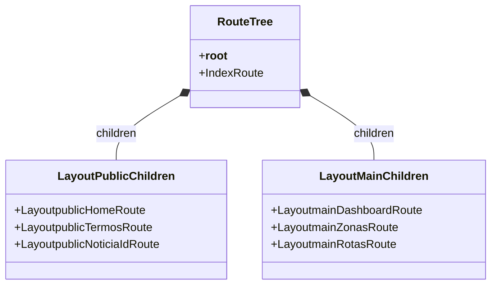

# Routing & Navigation

## Table of Contents
- [[Frontend/Frontend Overview]]
- [[Frontend/Component Library]]

## Arquitetura de Roteamento

A aplicação utiliza o `@tanstack/react-router` configurado num regime estrito e de geração automática de código. O ficheiro `routeTree.gen.ts` atua como o mapa global de toda a navegação, sendo atualizado automaticamente, garantindo desta forma segurança de tipos (Type-Safety) aquando da passagem de parâmetros e chamadas para novos caminhos. Desta forma, a navegação para rotas inexistentes gera erros em tempo de compilação.

A árvore de roteamento bifurca-se principalmente em duas grandes *layouts*, agrupando rotas com lógicas de contexto idêntico.

```mermaid
graph TD
    Root[__root__] --> Index[/]
    Root --> Auth[Login, Register, Reset...]
    Root --> LPublic[_layoutpublic]
    Root --> LMain[_layoutmain]
    
    LPublic --> PubAcessibilidade[/acessibilidade]
    LPublic --> PubHome[/home]
    LPublic --> PubTermos[/termos]
    
    LMain --> MainDash[/dashboard]
    LMain --> MainMap[/mapa]
    LMain --> MainZonas[/zonas]
```
> **Sources:** `apps/web/src/routeTree.gen.ts:L11-L42` · `apps/web/src/routeTree.gen.ts:L692-L701`

## Rotas de Autenticação e Layouts

Para lá de áreas genéricas e sem prefixo de *layout* (como ecrãs soltos de autenticação: login, registo, recuperação e verificação de e-mail), a aplicação estrutura a grande maioria das suas páginas sob duas hierarquias globais:

1. **`_layoutpublic` (Área Pública):** Este *layout* envelopa rotas de acesso comum e sem a obrigatoriedade de sessão, como a página inicial (Home), Termos e Condições, Políticas de Privacidade e leitura de Notícias isoladas (usando parâmetros dinâmicos na rota, como é exemplo de `/noticia/$id`).
2. **`_layoutmain` (Área Restrita / Dashboard):** Responsável por carregar o esqueleto principal interativo e autenticado. Suporta todas as operações e visualizações críticas da entidade (e.g., Ecopontos, Rotas, Zonas, Utilizadores, Campanhas, Analytics e Configurações Administrativas). O layout intermédio (`DashboardLayout`) provê a base para cada uma destas vistas.

A declaração de interfaces como `FileRoutesByFullPath` e `FileRoutesById` injeta diretamente as rotas possíveis na API do TypeScript para a biblioteca do TanStack Router, fortificando toda a estrutura do projeto a alterações arquiteturais de rotas.


> **Sources:** `apps/web/src/routeTree.gen.ts:L626-L690`

---
*[[index|← Back to Index]] · Generated by repowiki*
