# Arquitetura de Rotas (Routing Architecture)

## Table of Contents
- [[Frontend/Routing Architecture]]
- [[Frontend/Layouts and Navigation]]
- [[Frontend/UI Components Library]]
- [[Frontend/State Management Flow]]

## Visão Geral do Sistema de Rotas

O ecossistema do frontend do **Ecobairro** utiliza o **TanStack Router** para gerir o encaminhamento (routing) da aplicação de forma estática e tipada. Ao contrário de routers tradicionais baseados em strings dinâmicas no runtime, o TanStack Router analisa a estrutura de ficheiros no diretório `routes` e gera uma árvore de rotas tipada e segura em tempo de compilação, localizada em `routeTree.gen.ts`.

Este design oferece:
- **Segurança de Tipos (Type Safety):** Os links, parâmetros de pesquisa (search params) e parâmetros de caminho (path params) são validados pelo compilador do TypeScript.
- **Divisão de Código Eficiente (Code Splitting):** O router carrega dinamicamente apenas os componentes necessários para a rota ativa.
- **Proteção Automatizada:** A validação de sessões e autorizações ocorre nos ganchos (hooks) de ciclo de vida das rotas (`beforeLoad`).

---

## Estrutura da Árvore de Rotas (Route Tree)

A raiz da aplicação é gerida pelo `__root.ts` (`rootRouteImport`), a partir da qual ramificam-se três grupos principais de rotas:

1. **Rotas de Acesso Direto (Raiz):** Rotas utilitárias ou páginas simples localizadas fora de layouts complexos (ex: `/login`, `/register`, `/forgot-password`, `/reset-password`, `/verify-email`).
2. **Rotas Públicas com Layout (`_layoutpublic`):** Rotas sob o layout público (com caminho visual de URL plano `/`), contendo páginas como `/home`, `/como-funciona`, `/acessibilidade`, `/privacidade` e `/termos`.
3. **Rotas Protegidas com Layout (`_layoutmain`):** Rotas sob o layout de painel (dashboard) com caminho visual de URL plano `/`, exigindo autenticação obrigatória via `requireAuth`. Exemplos: `/dashboard`, `/admin`, `/zonas`, `/ecopontos`, `/reportes`, etc.

### Diagrama da Hierarquia de Rotas

```mermaid
graph TD
    Root["__root__ (rootRouteImport)"] --> Index["/ (index)"]
    Root --> Login["/login"]
    Root --> Register["/register"]
    Root --> Forgot["/forgot-password"]
    Root --> Reset["/reset-password"]
    Root --> Verify["/verify-email"]
    
    Root --> LayoutPublic["_layoutpublic (Pathless Layout)"]
    LayoutPublic --> Home["/home"]
    LayoutPublic --> ComoFunciona["/como-funciona"]
    LayoutPublic --> Acessibilidade["/acessibilidade"]
    LayoutPublic --> Privacidade["/privacidade"]
    LayoutPublic --> Termos["/termos"]
    LayoutPublic --> NoticiaDetail["/noticia/$id"]
    
    Root --> LayoutMain["_layoutmain (Pathless Layout - requireAuth)"]
    LayoutMain --> Dashboard["/dashboard"]
    LayoutMain --> Admin["/admin"]
    LayoutMain --> Zonas["/zonas"]
    LayoutMain --> Utilizadores["/utilizadores"]
    LayoutMain --> Ecopontos["/ecopontos"]
    LayoutMain --> Reportes["/reportes"]
    LayoutMain --> Analytics["/analytics"]
    LayoutMain --> Outros["Outras rotas privadas (/rotas, /recolhas, etc.)"]
```



---

## Guardas de Acesso (Auth Guards) e Permissões

A proteção de rotas no TanStack Router é configurada através da propriedade `beforeLoad` ao instanciar ou atualizar uma rota. O ficheiro `apps/web/src/lib/auth.ts` expõe funções utilitárias que lançam redirecionamentos quando as condições não são cumpridas.

* **`requireAuth`**: Verifica se há uma sessão de utilizador válida (não nula e diferente de `guest`). Se for inválida, redireciona o utilizador para a página `/login`.
* **`requireRole(allowedRoles)`**: Estende a proteção de autenticação exigindo que o papel (role) do utilizador esteja presente no array de privilégios permitidos. Caso o papel não seja válido, o utilizador é redirecionado para a sua rota padrão de acordo com a função `getDefaultRouteForRole`.

### Exemplo de Aplicação de Guarda

Na rota principal de layout protegido (`_layoutmain.tsx`):

```typescript
export const Route = createFileRoute('/_layoutmain')({
  beforeLoad: requireAuth,
  errorComponent: DashboardError,
  component: DashboardRoute,
})
```

Se a autenticação falhar antes de carregar o componente, a renderização é imediatamente interrompida e o utilizador é redirecionado. Se ocorrer um erro durante a carga ou renderização, o `DashboardError` é acionado para exibir uma interface amigável.

---

## Interfaces e Augmentação de Tipos

O TanStack Router gera tipos específicos no TypeScript para garantir a integridade da aplicação. No ficheiro `routeTree.gen.ts`, isso é feito através de interfaces como `FileRoutesByFullPath`, `FileRoutesByTo` e `FileRoutesById`, registadas no módulo `@tanstack/react-router` através de declaração de módulo:

```typescript
declare module '@tanstack/react-router' {
  interface FileRoutesByPath {
    '/verify-email': {
      id: '/verify-email'
      path: '/verify-email'
      fullPath: '/verify-email'
      preLoaderRoute: typeof VerifyEmailRouteImport
      parentRoute: typeof rootRouteImport
    }
    // ...
  }
}
```

Isso garante que, ao usar componentes de navegação da biblioteca (ex: `<Link to="/dashboard">`), o programador receba erros de compilação imediatos caso tente ligar a uma rota inexistente ou passar parâmetros incompatíveis.

> **Sources:** apps/web/src/routeTree.gen.ts:L1-L727, apps/web/src/lib/auth.ts:L59-L78, apps/web/src/routes/_layoutmain.tsx:L33-L37

---
*[[index|← Back to Index]] · Generated by repowiki*
