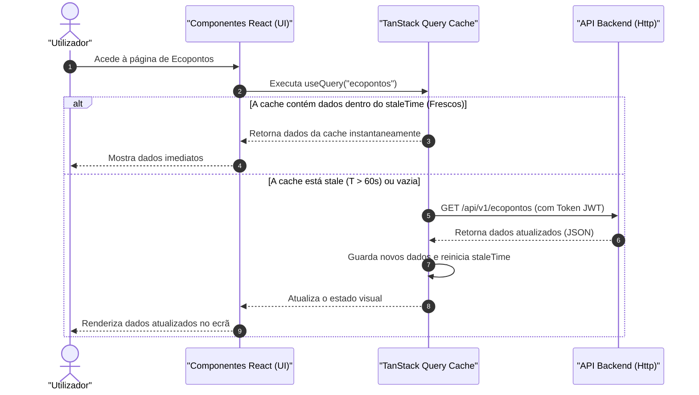

# Fluxo de Gestão de Estado (State Management Flow)

## Table of Contents
- [[Frontend/Routing Architecture]]
- [[Frontend/Layouts and Navigation]]
- [[Frontend/UI Components Library]]
- [[Frontend/State Management Flow]]

## Tipologias de Estado na Aplicação

O ecossistema do **Ecobairro** divide a sua gestão de estado em três categorias fundamentais com propósitos e ciclos de vida bem definidos:

1. **Estado de Interface Local (UI State):** Controla o comportamento imediato de elementos visuais (ex: se o menu lateral está expandido ou se um modal está aberto). É gerido usando hooks nativos do React como `useState`.
2. **Estado de Sessão Persistente (Auth State):** Guarda a informação do utilizador ligado e as chaves de segurança (JWT tokens) necessários para validar e autorizar pedidos à API. É persistido no armazenamento do browser.
3. **Estado de Servidor (Server State):** Armazena dados obtidos da API (ex: listas de ecopontos, reportes, rotas). É gerido pela biblioteca **TanStack Query** (anteriormente React Query), que lida com cache, revalidações e sincronização em segundo plano.

---

## Gestão de Estado do Servidor (TanStack Query)

O estado de servidor é centralizado através de um cliente global de query criado pelo método `createQueryClient()` (em `client.ts`). A sua configuração estabelece políticas para otimizar a performance e evitar chamadas excessivas ao backend:

* **`staleTime: 60000` (60 segundos):** Determina que qualquer dado obtido é considerado "fresco" durante 1 minuto. Pedidos subsequentes dentro deste intervalo lêem os dados diretamente da cache do browser de forma instantânea.
* **`retry: 1`**: Em caso de falha de rede, a query efetua apenas uma tentativa automática de re-chamada para não sobrecarregar servidores instáveis.
* **`refetchOnWindowFocus: false`**: Impede que a aplicação realize novas chamadas ao servidor sempre que o utilizador muda de tab ou desfoca/foca a janela do navegador.

### Fluxo de Sincronização de Dados

O diagrama abaixo ilustra como o componente UI interage com a cache e a API backend:



---

## Gestão de Sessão e Tokens (Auth State)

O estado de autenticação utiliza armazenamento físico no browser para manter a sessão ativa mesmo após um recarregamento da página (refresh). O ficheiro `auth.ts` expõe métodos que encapsulam a leitura e escrita destas variáveis:

### Armazenamento de Sessão (`localStorage` vs `sessionStorage`)
A persistência adapta-se à preferência de segurança escolhida pelo utilizador no momento do login (através do parâmetro `rememberMe`):
* **`rememberMe = true`**: Grava os dados em **`localStorage`** (permanente, mantido mesmo após fechar o browser).
* **`rememberMe = false` (Padrão):** Grava os dados em **`sessionStorage`** (temporário, destruído ao fechar a janela).

### Estrutura de Chaves Armazenadas:
- **`user`**: Objeto JSON serializado que descreve o perfil do utilizador autenticado (contendo ID, nome, e-mail e papel `UserRole`).
- **`access_token`**: Chave de portador JWT de curta duração incluída nos cabeçalhos de todos os pedidos HTTP.
- **`refresh_token`**: Chave JWT de longa duração usada para obter novos access tokens sem interromper a navegação do utilizador.

```typescript
export function getUser(): User | null {
  const stored = sessionStorage.getItem('user') || localStorage.getItem('user')
  if (!stored) return null
  try {
    return JSON.parse(stored) as User
  } catch {
    return null
  }
}
```

O método `clearAuthSession` remove todas as chaves de ambos os armazenamentos ao efetuar logout, garantindo a invalidação imediata do estado local antes do utilizador ser redirecionado para a página pública.

---

## Estado Local de Interface (UI)

O estado local de interface é confinado a componentes de layout e apresentação. No ficheiro `_layoutmain.tsx`, dois estados booleanos locais controlam o esqueleto visual responsivo:

* **`collapsed`**: Booleano que define se o menu lateral no desktop deve ser exibido com ícones pequenos ou de forma expandida.
* **`mobileOpen`**: Booleano que interage com o trigger de fecho e abertura da folha móvel (`Sheet`), cuja sincronização de abertura é enviada para a `Navbar` e a de fecho é controlada pela própria folha.

Esta separação clara garante que alterações de estilo de interface não gerem renderizações redundantes noutras partes do sistema, mantendo a responsividade da aplicação.

---

## Estado de Paginação/Filtros na URL (`nuqs`)

As páginas de lista (utilizadores, ecopontos, campanhas, audit, fila, partilhas,
reportes, recolhas, notícias e o dashboard) guardam o estado de **paginação,
pesquisa e filtros na query string** através da biblioteca [`nuqs`](https://nuqs.dev).
Vantagens: URLs partilháveis, navegação back/forward do browser e recarga da
página preservam o estado — e a **base de dados só busca a página pedida**
(`page`/`pageSize`), poupando recursos.

* **Adapter:** a app é envolvida em `<NuqsAdapter>` (`nuqs/adapters/react`) em
  `apps/web/src/main.tsx`, dentro do `QueryClientProvider`. O adapter genérico
  usa a History API e coexiste com o TanStack Router.
* **Hook partilhado:** `apps/web/src/lib/use-list-query.ts` expõe `useListQuery`,
  que combina `page` (inteiro, default 1) com os parsers de filtros fornecidos
  (`parseAsString`). Devolve `{ params, setPage, setFilters, pageSize }`.
  `setFilters` repõe sempre `page = 1` ao alterar filtros/pesquisa. `clearOnDefault`
  mantém a URL limpa nos valores por omissão.
* **Padrão por página:** a pesquisa textual usa um espelho local (`useState`)
  empurrado para a URL com *debounce* (~350 ms); o `load()` lê `params` e chama
  `fetchJson` com `page`/`pageSize`; a UI usa `<PaginationBar>` (ver
  [[Frontend/Component Library]]).
* **TanStack Router:** as rotas `reportes` e `recolhas` declaram `validateSearch`
  para deep-links (`novo`, `local`, `tipo`); as chaves geridas pelo nuqs
  (`page`, `q`, `status`) são declaradas aí como *passthrough* para o router não
  as remover da URL.

> Páginas de **mapa/agregação** (`mapa-sensores`, `rotas`, `zonas`, `analytics`,
> `home`) **não** são paginadas — precisam do conjunto completo de pontos.

> **Sources:** apps/web/src/lib/query/client.ts:L11-L21, apps/web/src/lib/auth.ts:L7-L40, apps/web/src/routes/_layoutmain.tsx:L42-L44, apps/web/src/lib/use-list-query.ts, apps/web/src/main.tsx

---
*[[index|← Back to Index]] · Generated by repowiki*
