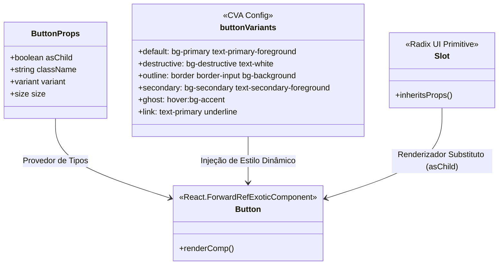

# Biblioteca de Componentes UI (UI Components Library)

## Table of Contents
- [[Frontend/Routing Architecture]]
- [[Frontend/Layouts and Navigation]]
- [[Frontend/UI Components Library]]
- [[Frontend/State Management Flow]]

## Filosofia de Design e Organização de Componentes

A interface do **Ecobairro** é construída com base em componentes modulares, seguindo os padrões do **shadcn/ui**. Em vez de depender de uma biblioteca de componentes pré-compilados e pesados de terceiros, a aplicação adota o modelo de componentes locais, onde cada elemento de interface (botões, modais, formulários) é copiado para o diretório `components/ui` e pode ser totalmente customizado.

Estes componentes assentam em três pilares tecnológicos:
1. **Radix UI:** Biblioteca de primitivos Web não-estilizados e acessíveis (garantindo conformidade com WAI-ARIA).
2. **Tailwind CSS:** Utilizado para a estilização via classes utilitárias rápidas e coerentes.
3. **Class Variance Authority (CVA):** Biblioteca utilitária para definir variantes e tamanhos de forma tipada no TypeScript.

---

## O Componente Button: Anatomia e Padrões

O componente `Button` (declarado em `button.tsx`) serve como o padrão arquitetural para todos os componentes interativos do sistema. Ele ilustra como classes dinâmicas, propriedades HTML nativas e propriedades personalizadas se integram.

### Estrutura do Componente



---

## Variantes e Customização Dinâmica

O estilo visual do botão é configurado através do método `cva()`, que mapeia as propriedades de estilo do componente para classes CSS específicas:

### Variantes Visuais (`variant`)
- **`default`**: Fundo de cor primária da marca (`bg-primary`) com texto contrastante, ideal para ações principais.
- **`destructive`**: Cor vermelha/alerta (`bg-destructive`), usado para ações críticas e irreversíveis (como eliminar registos).
- **`outline`**: Borda fina cinza com fundo transparente, adequado para ações secundárias que partilham espaço com botões principais.
- **`secondary`**: Fundo cinza suave (`bg-secondary`), para opções de menor prioridade.
- **`ghost`**: Sem fundos ou bordas padrão, destacando-se apenas em eventos de foco/hover.
- **`link`**: Estilo de hiperligação tradicional (`text-primary` e sublinhado ao passar o rato).

### Tamanhos do Componente (`size`)
- **`default`**: Altura de `9rem` (`h-9`) e padding horizontal padrão.
- **`sm`**: Botão compacto (`h-8`, texto menor), ideal para tabelas ou áreas com densidade de informação.
- **`lg`**: Botão destacado (`h-10`), ideal para formulários de destaque ou hero banners.
- **`icon`**: Botão quadrado (`h-9 w-9`) concebido especificamente para conter apenas ícones.

---

## Polimorfismo com a Propriedade `asChild`

Uma das capacidades mais avançadas do componente é o suporte à propriedade **`asChild`**, obtida a partir do primitivo **`Slot`** da Radix UI:

```typescript
const Comp = asChild ? Slot : 'button'
```

* **Sem `asChild` (Padrão):** O componente renderiza uma tag HTML `<button>` padrão no DOM.
- **Com `asChild={true}`:** O componente não cria um novo elemento no DOM. Em vez disso, ele clona e funde as suas propriedades (estilos Tailwind, comportamentos de clique) diretamente com o seu elemento filho imediato.

Isto é extremamente útil para a integração com routers (como o TanStack Router), permitindo que um componente de link seja estilizado exatamente como um botão sem introduzir tags HTML inválidas (como aninhar um `<button>` dentro de um `<a>`):

```tsx
<Button asChild variant="outline">
  <Link to="/dashboard">Ir para Painel</Link>
</Button>
```

---

## Função Utilitária `cn` (Class Merger)

Para garantir que classes customizadas passadas externamente via `className` não entrem em conflito com as classes padrão do CVA, utiliza-se a função utilitária `cn`:

```typescript
className={cn(buttonVariants({ variant, size, className }))}
```

A função `cn` (importada de `@/lib/utils`) encapsula as bibliotecas `clsx` e `tailwind-merge`. Ela resolve conflitos de classes de forma inteligente (por exemplo, se o CVA definir `px-4` e a classe externa passar `px-6`, a biblioteca garante que apenas a classe final de maior precedência seja mantida na folha de estilos gerada).

> **Sources:** apps/web/src/components/ui/button.tsx:L1-L47

---
*[[index|← Back to Index]] · Generated by repowiki*
