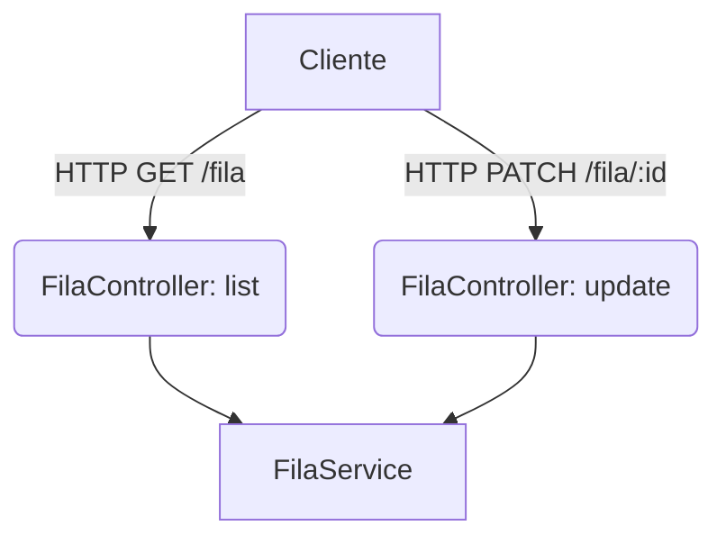

# Background Tasks Overview

## Table of Contents
- [[Jobs/Task Queues]]
- [[Jobs/Celery Configuration]]

## Visão Geral

A gestão de tarefas em segundo plano (background jobs) é exposta através do `FilaController`. Este controlador é responsável por listar e atualizar as tarefas que estão na fila de processamento, garantindo que o estado das tarefas pode ser consultado e modificado remotamente através da API REST.

Todos os endpoints expostos pelo controlador requerem autenticação através da guarda `JwtAuthGuard`. O processamento real das filas é delegado ao serviço correspondente (`FilaService`).

> **Sources:** `apps/api/src/fila/fila.controller.ts:L16-L33`

---
*[[index|← Back to Index]] · Generated by repowiki*
