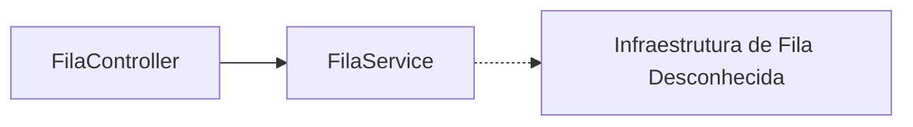

# Celery Configuration

## Table of Contents
- [[Jobs/Background Tasks Overview]]
- [[Jobs/Task Queues]]

## Configuração do Celery

Não foram encontradas configurações específicas do Celery ou da infraestrutura de processamento assíncrono associada nos ficheiros analisados para esta secção. O sistema faz uso do `FilaController` para exposição da API REST, delegando a lógica para o `FilaService`. Pode não utilizar o Celery, mas sim outra ferramenta de filas nativa do ecossistema NestJS/Node.js, como o BullMQ.

> **Sources:** `apps/api/src/fila/fila.controller.ts:L1-L34`

---
*[[index|← Back to Index]] · Generated by repowiki*
