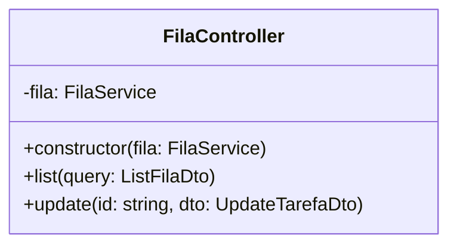

# Task Queues

## Table of Contents
- [[Jobs/Background Tasks Overview]]
- [[Jobs/Celery Configuration]]

## O Controlador de Fila

O `FilaController` expõe os endpoints REST para a gestão das filas de tarefas.

### Endpoints Disponíveis

1. **Listagem de Tarefas (`GET /fila`)**
   - Utiliza a função `list(@Query() query: ListFilaDto)`.
   - Permite a consulta e filtragem das tarefas presentes na fila (`estado`).
   - **Paginação:** aceita `page`/`pageSize` e devolve `{ tarefas, total, page, pageSize }` (default `pageSize = 10`), buscando só uma página à base de dados.
   - **Ordenação por prioridade na BD:** a ordem (crítica → alta → normal → baixa, depois `criado_em`) é feita em SQL via `$queryRaw` com um `CASE` — a coluna `prioridade` é texto, logo um `orderBy` normal do Prisma ordenaria alfabeticamente. Sem ordenação na BD a paginação não faria sentido (a página 1 tem de trazer as tarefas mais críticas).

2. **Atualização de Tarefas (`PATCH /fila/:id`)**
   - Utiliza a função `update(@Param('id') id: string, @Body() dto: UpdateTarefaDto)`.
   - Permite alterar o estado ou informações de uma tarefa específica utilizando o seu `id`.

> **Sources:** `apps/api/src/fila/fila.controller.ts:L16-L33`

---
*[[index|← Back to Index]] · Generated by repowiki*
