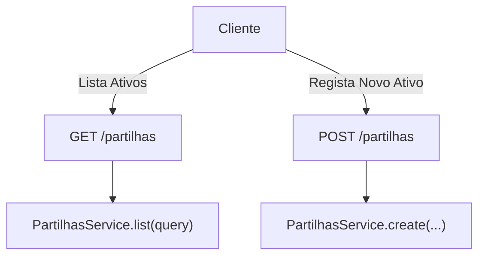

# Asset Management

## Table of Contents
- [[Media/File Uploads]]
- [[Media/Media Storage]]

## Gestão de Ativos nas Partilhas

A gestão de ativos no módulo de partilhas baseia-se na criação e listagem de recursos comunitários. O `PartilhasController` expõe dois endpoints principais para este fim:
1. Um método de listagem (`GET /partilhas`), que permite pesquisar e obter todos os ativos registados no sistema.
2. Um método de criação (`POST /partilhas`), onde os cidadãos podem registar novos ativos, associando-lhes uma eventual referência multimédia.

Os ativos em si são apenas abstraídos e representados por categorias (que são parte integrante da partilha), com imagens associadas fornecidas por URL.

> **Sources:** `apps/api/src/partilhas/partilhas.controller.ts:L22-L35`

---
*[[index|← Back to Index]] · Generated by repowiki*
