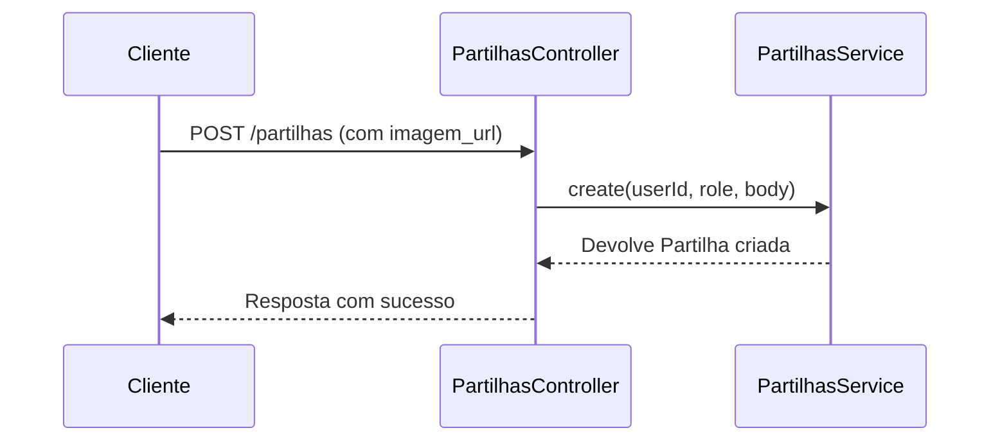

# File Uploads

## Table of Contents
- [[Media/Media Storage]]
- [[Media/Asset Management]]

## Gestão de Uploads no Controlador de Partilhas

Atualmente, o sistema de partilhas não processa uploads diretos de ficheiros (como imagens em formato multipart) no seu controlador. O `PartilhasController` recebe os dados através do método `create`, onde a imagem é passada sob a forma de um URL (`imagem_url`) incluído no corpo do pedido (`CreatePartilhaDto`).

Isto significa que qualquer processo de upload de ficheiros deve ser realizado previamente (por exemplo, através de um serviço externo de alojamento ou um endpoint dedicado ainda não documentado neste fluxo), antes de o URL final ser submetido para criação da partilha.

> **Sources:** `apps/api/src/partilhas/partilhas.controller.ts:L28-L35`

---
*[[index|← Back to Index]] · Generated by repowiki*
