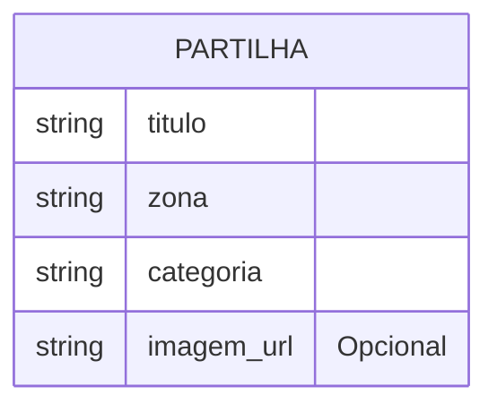

# Media Storage

## Table of Contents
- [[Media/File Uploads]]
- [[Media/Asset Management]]

## Armazenamento de Imagens de Partilhas

O armazenamento de media associado a partilhas é referenciado no código de forma ligeira. Em vez de armazenar blobs ou ficheiros no controlador da aplicação, o sistema guarda referências a estes ficheiros sob a forma de URLs (através da propriedade submetida para o `PartilhasController`). 

Sempre que uma nova partilha é criada (via `POST /partilhas`), o corpo do pedido pode conter uma referência a um ficheiro externo de imagem. Assim, a camada de dados armazena apenas a string (o URL) e não o ficheiro binário em si.

> **Sources:** `apps/api/src/partilhas/partilhas.controller.ts:L28-L35`

---
*[[index|← Back to Index]] · Generated by repowiki*
