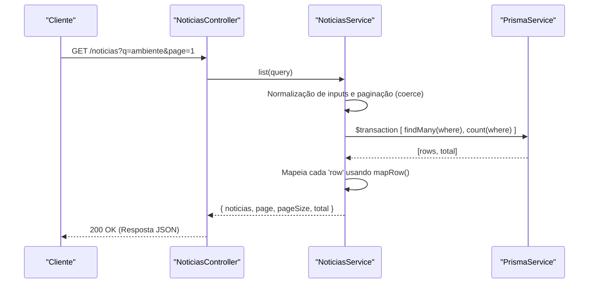

# Gestão de Notícias

O Módulo de Notícias do ecobairro é responsável pela disponibilização e listagem das notícias e novidades da plataforma. A API fornece endpoints focados na consulta e leitura destes conteúdos, suportando funcionalidades vitais como a paginação segura e a pesquisa textual.

> **Sources:** apps/api/src/noticias/noticias.controller.ts:L6-L24

## Endpoints Disponíveis

A interação com as notícias é feita através do `NoticiasController`, que expõe os seguintes endpoints de leitura:

- **Listagem de Notícias (`GET /noticias`)**: Permite listar as notícias mais recentes com suporte a paginação (`page`, com valor por defeito 1, e `pageSize`, por defeito 10). Aceita ainda o parâmetro opcional de pesquisa `q`, que filtra os resultados correspondentes no `titulo` ou no `resumo` (pesquisa insensível a maiúsculas/minúsculas).
- **Detalhe da Notícia (`GET /noticias/:id`)**: Devolve a informação completa de uma única notícia através do seu identificador. Se o registo não for encontrado na base de dados, devolve um erro HTTP 404 (via `NotFoundException`) com a mensagem "Notícia não encontrada".

> **Sources:** apps/api/src/noticias/noticias.controller.ts:L11-L23, apps/api/src/noticias/noticias.service.ts:L18-L50

## Arquitetura e Fluxo de Dados

Toda a lógica de acesso, tratamento de parâmetros e consulta à base de dados está isolada no `NoticiasService`, interagindo com o ORM através do serviço `PrismaService`. 

> **Sources:** apps/api/src/noticias/noticias.controller.ts:L11-L14, apps/api/src/noticias/noticias.service.ts:L18-L43

## Tratamento e Transformação de Dados

A segurança estrutural das respostas é assegurada por mecanismos de limpeza e conversão de dados internos:

1. **Validação de Inputs (`coerce`)**: Os parâmetros de paginação providenciados pelo cliente são convertidos para números inteiros positivos de forma segura, garantindo tolerância a falhas na entrada.
2. **Mapeamento do Contrato (`mapRow`)**: As instâncias diretamente recebidas do modelo da base de dados nunca são expostas aos clientes sem filtragem. A função `mapRow` converte os dados do modelo no DTO `NoticiaRecord` definido pelo ecobairro (`@ecobairro/contracts`). Isto inclui o empacotamento de datas (`publishedAt` para ISO 8601 string) e transformação de chaves com notação camelCase para formato padrão (ex: `imagemUrl` torna-se `imagem_url`).

> **Sources:** apps/api/src/noticias/noticias.service.ts:L53-L84

Para mais contexto sobre a camada de persistência e interações, verifique a secção de [[Database/Schema Overview]] e descubra mais detalhes de autenticação em [[Security/Authentication Flow]]. Para voltar à vista principal, retorne ao [[index]].
