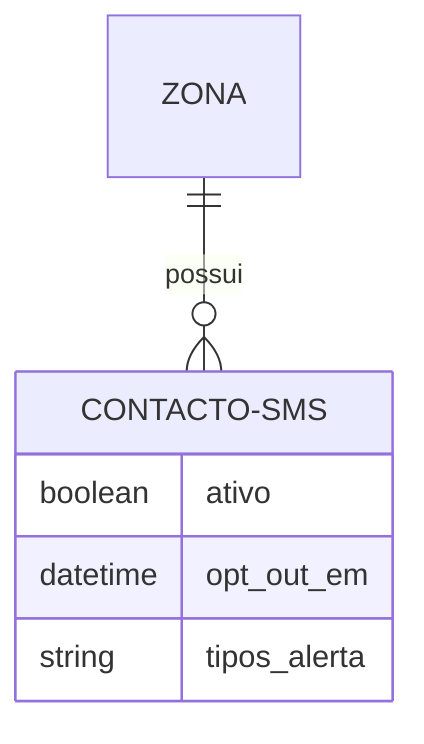
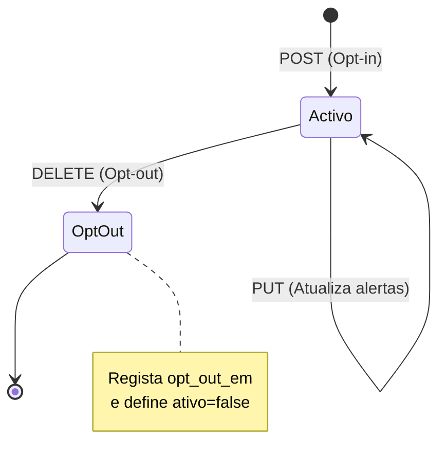

# Email & SMS Providers

## Table of Contents
- [[Notifications/Notification Architecture]]
- [[Notifications/Push Notifications]]

## Gestão de Contactos SMS por Zona

O subsistema de contactos SMS permite a gestão de destinatários associados a diferentes zonas para emissão de alertas e notificações operacionais (RF-27). A interface é restrita a utilizadores com perfis de `GESTOR` ou `ADMIN`, garantindo que os fluxos de comunicação são configurados apenas por pessoal autorizado.

Toda a lógica está implementada via NestJS, fazendo uso de bases de dados PostgreSQL, sendo as leituras encaminhadas para as réplicas e as escritas para o node master da base de dados.

### Endpoints de Gestão de SMS

O modelo define uma rota principal alocada ao contexto da Zona (`/zonas/:id/contactos-sms`), permitindo operações de listagem, adesão e gestão de alertas.

- **Listagem de Contactos:** `GET /zonas/:id/contactos-sms` - Retorna a lista de contactos atualmente ativos numa determinada zona (Leitura).
- **Adesão (Opt-in):** `POST /zonas/:id/contactos-sms` - Regista e associa um novo contacto validado à zona de forma a receber comunicações.
- **Configuração de Alertas:** `PUT /zonas/:id/contactos-sms/:contactoId` - Modifica as tipologias de alertas específicos ativados para aquele contacto individual na zona.

> **Sources:** `docs/models/IoT e Dispositivos/IoT/2.4 Contactos SMS (RF-27).md:L1-L6`

## Fluxo de Cancelamento de Subscrição (Opt-out)

Para garantir rastreabilidade histórica e conformidade na gestão de contactos, os contactos SMS não são apagados fisicamente da base de dados. O endpoint de remoção:
`DELETE /zonas/:id/contactos-sms/:contactoId`
funciona através de exclusão lógica ("soft delete" ou opt-out). 

Este processo atualiza os atributos do contacto registando a flag `ativo=false` e guardando a marca temporal exata no atributo `opt_out_em`.

> **Sources:** `docs/models/IoT e Dispositivos/IoT/2.4 Contactos SMS (RF-27).md:L7-L7`

---
*[[index|← Back to Index]] · Generated by repowiki*
