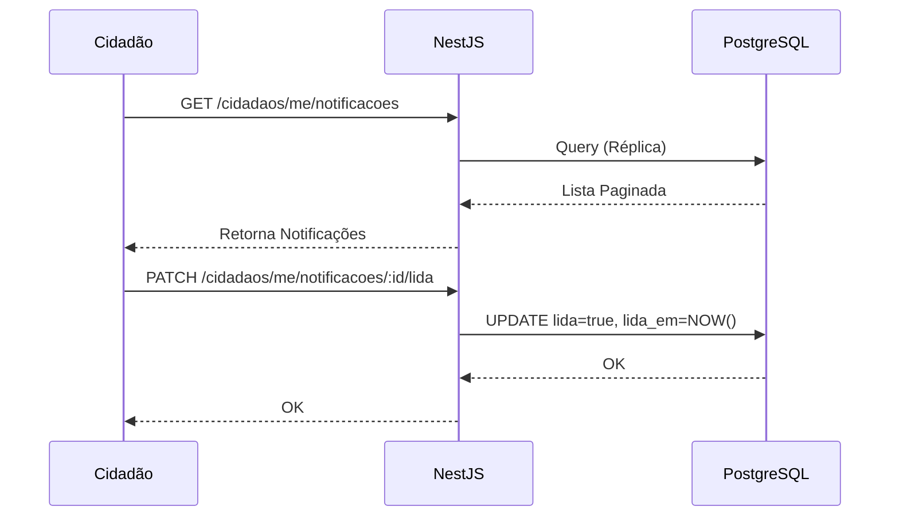
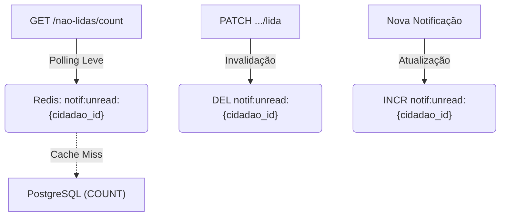

# Notification Architecture

## Table of Contents
- [[Notifications/Email & SMS Providers]]
- [[Notifications/Push Notifications]]

## Inbox do Cidadão e Gestão de Estado

A arquitetura do sistema de notificações assenta num modelo de caixa de entrada (inbox) para o Cidadão, gerida através de uma API REST desenvolvida em NestJS com persistência em PostgreSQL e otimização de leitura usando Redis.

Os cidadãos autenticados podem consultar as suas notificações de forma paginada e filtrar por estado de leitura e tipo (`/cidadaos/me/notificacoes`). As operações de leitura usam réplicas do PostgreSQL para garantir a escalabilidade. O estado das notificações permite a transição individual de leitura ou a marcação de todas as mensagens como lidas em bloco (bulk update).

### Endpoints Principais

A API de notificações expõe os seguintes endpoints principais para interação com o inbox do cidadão:

- **Inbox Paginado:** `GET /cidadaos/me/notificacoes` (Filtros: `?lida=&tipo=`)
- **Marcar como Lida:** `PATCH /cidadaos/me/notificacoes/:id/lida` (Regista `lida=true` e a data de leitura `lida_em`)
- **Marcar Todas como Lidas:** `PATCH /cidadaos/me/notificacoes/lidas-todas`
- **Eliminar:** `DELETE /cidadaos/me/notificacoes/:id`

> **Sources:** `docs/models/Reports, Recolhas, Comunicação e Operacional/notificacoes/4.2 Endpoints REST — Notificações.md:L1-L8`

## Otimização com Redis para Contadores

O contador de notificações não lidas (`/cidadaos/me/notificacoes/nao-lidas/count`) é fundamental para interfaces que necessitam de polling leve, minimizando a carga na base de dados principal. 

Esta contagem é suportada por cache no Redis com a chave `notif:unread:{cidadao_id}`. A chave possui um TTL (Time-To-Live) de 5 minutos.

O fluxo de invalidação da cache assegura a coerência dos dados:
- O contador sofre **incremento** sempre que é gerada uma nova notificação para o cidadão.
- A chave é **eliminada** (DEL) caso o cidadão marque uma notificação específica como lida ou marque todas as notificações do inbox simultaneamente. No próximo pedido de contador, haverá um fallback para contabilização via `PG COUNT`.

> **Sources:** `docs/models/Reports, Recolhas, Comunicação e Operacional/notificacoes/4.2 Endpoints REST — Notificações.md:L4-L18`

---
*[[index|← Back to Index]] · Generated by repowiki*
