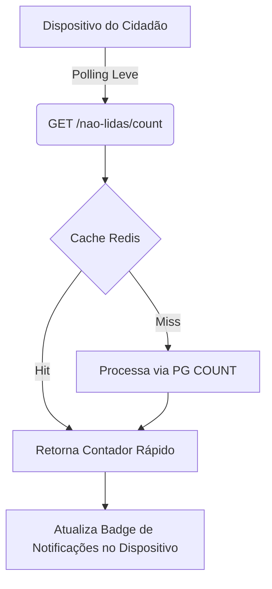

# Push Notifications

## Table of Contents
- [[Notifications/Notification Architecture]]
- [[Notifications/Email & SMS Providers]]

## Integração de Contadores de Notificações

No contexto do sistema de notificações e das interações com dispositivos móveis ou aplicações web, a apresentação de badges ou contadores de mensagens baseia-se na verificação de mensagens não lidas. 

De forma a permitir atualizações frequentes sobre notificações pendentes sem sobrecarregar a infraestrutura de dados relacional, a arquitetura expõe um mecanismo de polling leve para clientes.

### Polling Leve para Dispositivos

O endpoint `GET /cidadaos/me/notificacoes/nao-lidas/count` fornece aos clientes a quantidade de notificações por ler. Em dispositivos de interface, este dado pode ser integrado com eventuais sistemas visuais de "push" na interface do utilizador, atualizando o contador de alertas com baixo custo temporal e de processamento.

Este endpoint resolve a solicitação com prioridade para uma infraestrutura de cache, reduzindo o impacto de verificações contínuas por múltiplos clientes.

> **Sources:** `docs/models/Reports, Recolhas, Comunicação e Operacional/notificacoes/4.2 Endpoints REST — Notificações.md:L4-L4`

---
*[[index|← Back to Index]] · Generated by repowiki*
