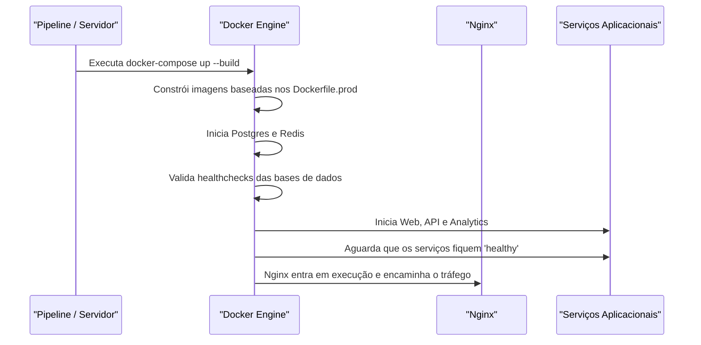
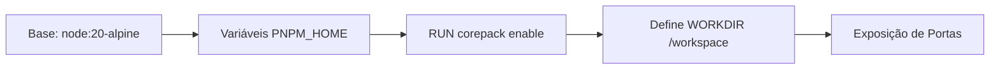

# Deployment Pipelines

## Table of Contents
- [[Operations/Docker Compose Setup]]
- [[Operations/Infrastructure Overview]]

## Estratégia de Deployment em Produção

O processo de deployment do Ecobairro é construído em cima de *containers* Docker e gerido através do Docker Compose, garantindo a uniformidade desde o momento em que a imagem é construída até à sua execução.

A infraestrutura aplicacional baseia-se num *monorepo* (gerido pelo utilitário `pnpm`), e as imagens Docker são geradas a partir da raiz do *workspace*. O ficheiro de orquestração de produção (`docker-compose.prod.yml`) assume a construção e inicialização contínua através das opções `build: context: ../..`.

> **Sources:** `infra/compose/docker-compose.prod.yml:L4-L52`

## Construção das Imagens Docker

Os serviços de frontend (Web) e backend em NodeJS (API) utilizam Dockerfiles específicos. No caso da base de construção (`apps/api/Dockerfile`), o ambiente parte da imagem otimizada `node:20-alpine`.

Um passo crítico da construção é a ativação do `corepack` e a configuração global das variáveis de ambiente para o instalador de pacotes (`PNPM_HOME`), essenciais para que as ferramentas do monorepo consigam instalar as dependências a partir dos ficheiros base (`pnpm-lock.yaml` e pacotes na diretoria `packages/`).

No ambiente de produção, as imagens utilizam versões de Dockerfile exclusivas (`Dockerfile.prod`), cujo objetivo é construir a aplicação de forma otimizada (sem dependências de dev, efetuando o transpile do Typescript e servindo os *assets* de forma estática para o frontend).

> **Sources:** `apps/api/Dockerfile:L1-L12` · `infra/compose/docker-compose.prod.yml:L14-L17`

---
*[[index|← Back to Index]] · Generated by repowiki*
