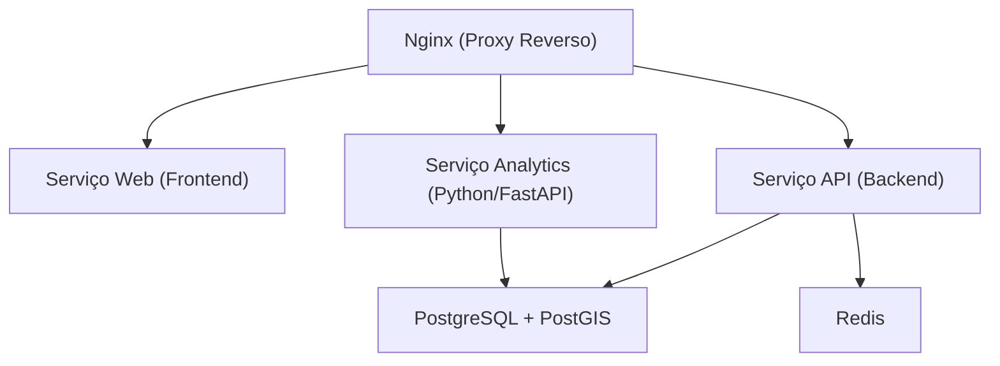

# Docker Compose Setup

## Table of Contents
- [[Operations/Infrastructure Overview]]
- [[Operations/Deployment Pipelines]]

## Ambientes e Configurações

O projeto Ecobairro utiliza o Docker Compose como ferramenta principal para orquestração de contentores, com configurações separadas para os ambientes de desenvolvimento (`docker-compose.yml`) e produção (`docker-compose.prod.yml`). 

### Ambiente de Desenvolvimento

O ambiente de desenvolvimento é desenhado para otimizar a experiência do programador, com foco no *hot-reloading* e na partilha de volumes entre a máquina local (host) e os contentores.
Utiliza uma âncora YAML `x-js-workspace-volumes` que mapeia o diretório raiz do *workspace* (`../../`) e os respetivos `node_modules` (raiz, web, api, pacotes comuns como contratos e configurações) para os contentores de NodeJS. Isto evita discrepâncias entre os binários compilados para o host (por exemplo, MacOS ou Windows) e os binários do ambiente Alpine dos contentores.

Os serviços expostos no desenvolvimento incluem ferramentas utilitárias como o **Mailpit** (para capturar e visualizar e-mails enviados em ambiente local), que não está presente no ambiente de produção.

> **Sources:** `infra/compose/docker-compose.yml:L3-L13` · `infra/compose/docker-compose.yml:L90-L94`

### Serviços e Healthchecks

Ambos os ambientes partilham a infraestrutura de base de dados e cache (PostgreSQL com PostGIS e Redis), bem como os serviços aplicacionais (Web, API e Analytics). Foi implementado um mecanismo de dependência explícita recorrendo ao `depends_on` com `condition: service_healthy` ou `service_started`.

A API e o Analytics contêm verificações de estado (Healthchecks) feitas através dos *endpoints* `/ready` para garantir que o Nginx apenas direciona tráfego para os serviços depois de estarem totalmente iniciados. O PostgreSQL utiliza o utilitário nativo `pg_isready`, enquanto o Redis usa `redis-cli ping`.

> **Sources:** `infra/compose/docker-compose.yml:L79-L88` · `infra/compose/docker-compose.yml:L138-L145`

### Ambiente de Produção

A configuração de produção distingue-se da de desenvolvimento pelas políticas de reinício automático (`restart: always`), utilização de *builds* de produção dedicados (ex: `Dockerfile.prod`) e a alocação dos serviços dentro de uma rede virtual isolada (`ecobairro-prod-network`). Em vez de expor portas diretamente à máquina hospedeira, a comunicação externa é feita exclusivamente via Cloudflare Tunnel para reforçar a segurança.

> **Sources:** `infra/compose/docker-compose.prod.yml:L1-L115`

---
*[[index|← Back to Index]] · Generated by repowiki*
