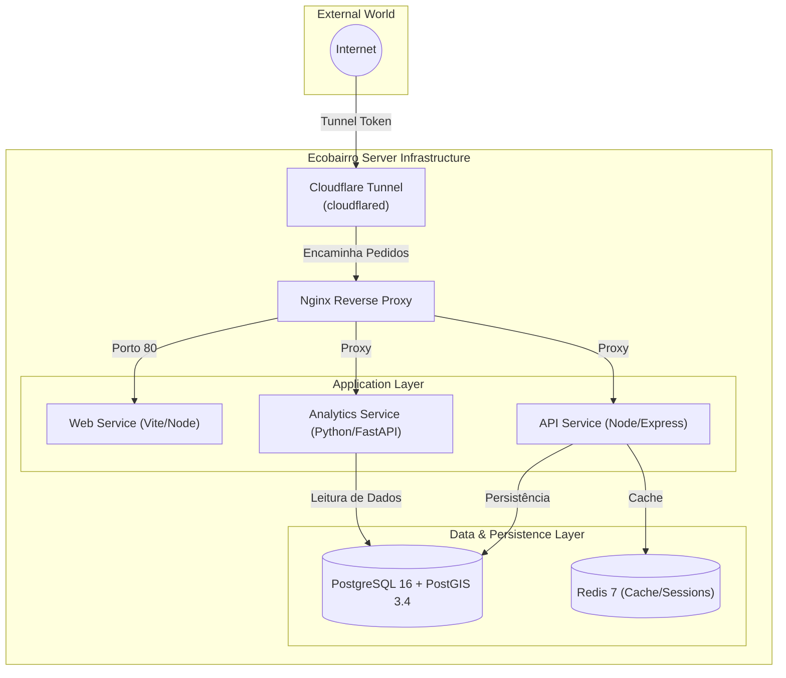

# Infrastructure Overview

## Table of Contents
- [[Operations/Docker Compose Setup]]
- [[Operations/Deployment Pipelines]]

## Topologia da Infraestrutura

A plataforma Ecobairro assenta numa arquitetura orientada a serviços (*Service-Oriented Architecture*). Cada componente funcional crítico roda no seu próprio contentor e os serviços comunicam entre si apenas se for estritamente necessário, promovendo o isolamento de responsabilidades e facilitando a escalabilidade individual.

A topologia está desenhada para garantir segurança de rede. Em ambiente de produção, não há portos de aplicações (Web, API ou Bases de Dados) diretamente mapeados para a máquina de hospedagem; todo o tráfego externo passa pelo túnel da Cloudflare e pelo proxy Nginx.

> **Sources:** `infra/compose/docker-compose.prod.yml:L53-L108`

## Componentes da Stack

A plataforma é composta pelos seguintes elementos principais:

1. **Serviços Cliente (Web):** A interface de utilizador, servida na porta 5173 em desenvolvimento. O *proxy* Nginx encaminha diretamente para o contentor `web` os pedidos de *frontend*.
2. **Serviços de Backend (API):** O núcleo da plataforma que trata de lógicas de negócio, gestão de acessos (JWT), reinicialização de palavras-passe e envio de emails transacionais (através de integração SMTP). O porto 3000 é utilizado internamente.
3. **Serviço de Análise (Analytics):** Módulo escrito em Python que interage com a base de dados PostgreSQL e expõe as suas APIs internas em `0.0.0.0:8000`.
4. **Bases de Dados (PostgreSQL + Redis):** A persistência central é assegurada pelo PostgreSQL, ampliado com a extensão PostGIS para suporte nativo a dados geoespaciais e de localização. O Redis funciona como um agregador de dados em memória, tipicamente gerindo sessões ou filas de tarefas.
5. **Gateway (Nginx + Cloudflare Tunnel):** O tráfego de entrada em produção não recorre a portas expostas via IP do servidor. O serviço `cloudflared` liga a infraestrutura local aos servidores da Cloudflare baseando-se no `TUNNEL_TOKEN`. Internamente, os pedidos chegam ao Nginx, que roteia dinamicamente os pacotes de dados para a `web`, `api` ou `analytics`.

> **Sources:** `infra/compose/docker-compose.yml:L14-L125` · `infra/compose/docker-compose.prod.yml:L81-L108`

---
*[[index|← Back to Index]] · Generated by repowiki*
