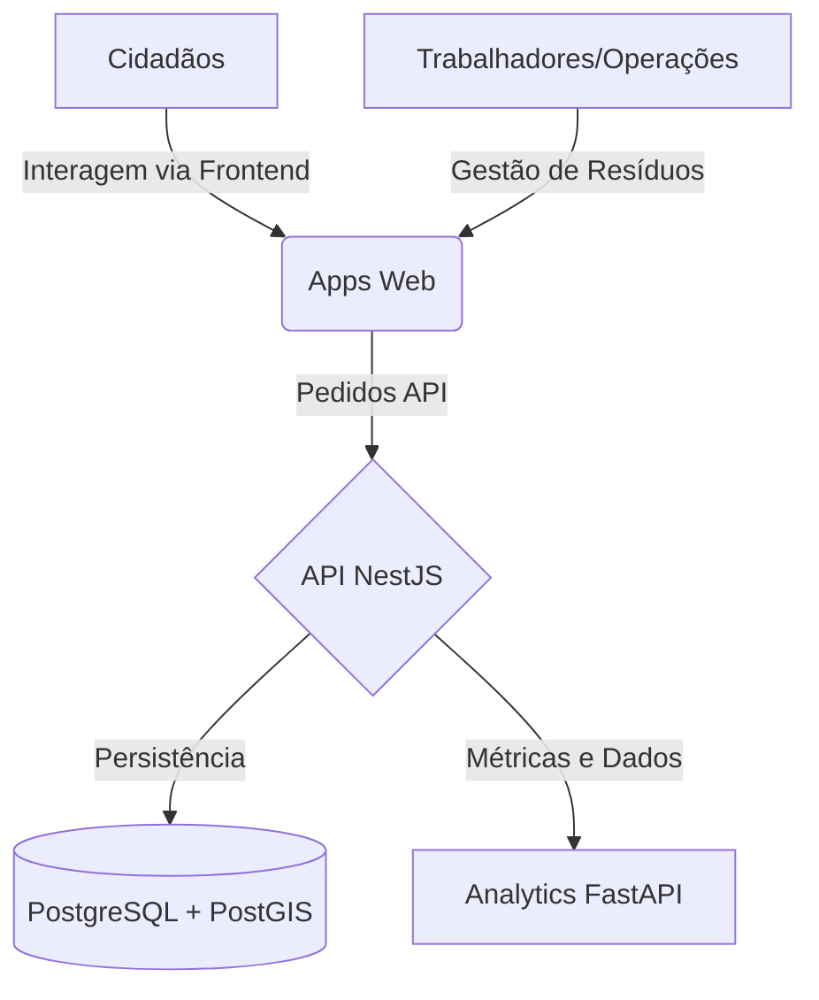
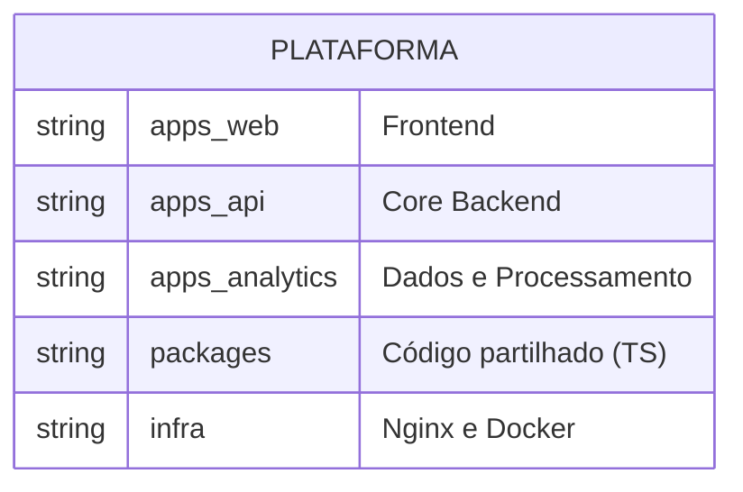

# Project Overview

## Table of Contents
- [[Overview/Tech Stack]]
- [[Overview/Quick Start Guide]]

## Introdução ao EcoBairro

O EcoBairro é uma plataforma abrangente cujo foco central reside na descoberta de ecopontos, recolha e tratamento de reportes, apresentação de métricas de telemetria e fornecimento de suporte operacional contínuo para os fluxos de trabalho que envolvem a gestão de resíduos. A solução visa não apenas integrar a visão do cidadão (através do seu perfil e funcionalidades de autenticação já incluídas na Fase 1), mas também coordenar e interligar a infraestrutura e a logística operacionais.

> **Sources:** `README.md:L1-L4` · `README.md:L16-L17`

## Estrutura da Plataforma

O repositório é composto por múltiplas camadas, de modo a suportar o ecosistema do EcoBairro de forma modularizada e escalável. 

- **Frontend (`apps/web`):** Uma aplicação web desenvolvida para a interação com o utilizador final, utilizando TanStack Start.
- **Backend Principal (`apps/api`):** Uma API desenvolvida em NestJS, onde reside a lógica central e os processos de autenticação e gestão do perfil do cidadão.
- **Analytics (`apps/analytics`):** Um serviço focado no processamento de dados e telemetria, utilizando FastAPI.
- **Pacotes Partilhados (`packages/`):** Elementos em TypeScript partilhados entre as diversas aplicações para assegurar consistência.
- **Infraestrutura e Orquestração (`infra/`):** Ficheiros para implantação com Docker Compose e gestão de routing através de Nginx.

> **Sources:** `README.md:L7-L17` · `README.md:L64-L69` · `README.md:L111-L119`

---
*[[index|← Back to Index]] · Generated by repowiki*
