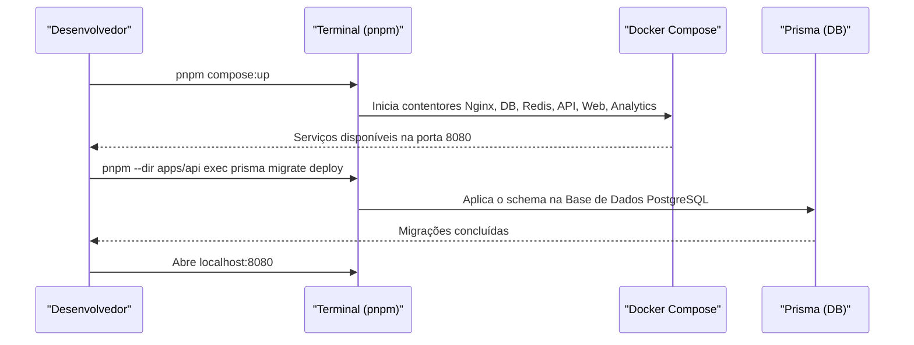
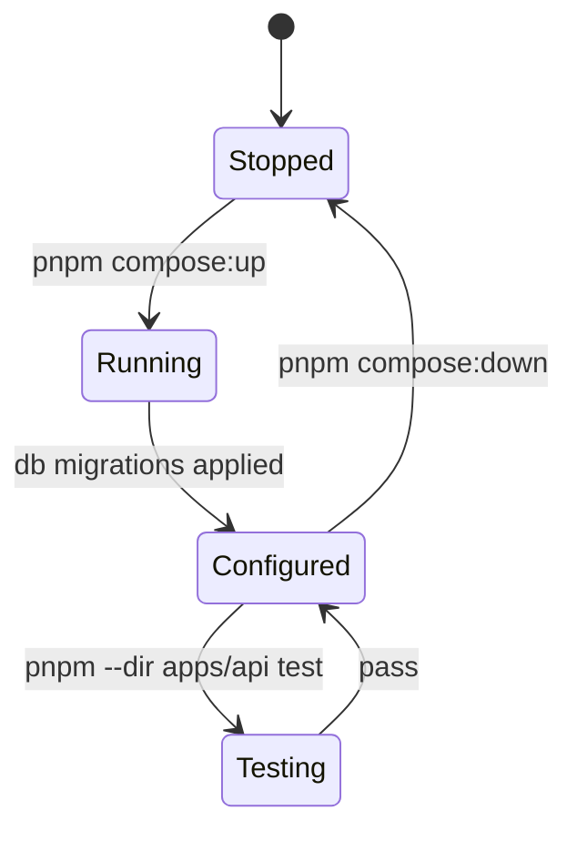

# Quick Start Guide

## Table of Contents
- [[Overview/Project Overview]]
- [[Overview/Tech Stack]]

## Pré-Requisitos e Inicialização

O arranque do projeto EcoBairro numa máquina de desenvolvimento requer algumas dependências fundamentais. Deve garantir que possui:
- O **Docker Desktop** (ou outro daemon Docker nativo) em execução.
- O **Node.js** com a ferramenta `pnpm` ativa (via Corepack).

Uma vez assegurados os requisitos, as dependências globais podem ser instanciadas e o servidor local ativado num processo otimizado.

> **Sources:** `README.md:L18-L22` · `README.md:L41-L54`

## Comandos Operacionais Principais

A raiz do repositório fornece um conjunto vasto de scripts geridos pelo `pnpm` para facilitar o fluxo de desenvolvimento sem bloquear terminais. 

- **Dependências e Linters:** 
  - `pnpm install --no-frozen-lockfile` instala dependências por todo o *workspace*.
  - `pnpm lint` e `pnpm typecheck` garantem a consistência e a validação do código.

- **Gestão do Docker:**
  - `pnpm compose:up` e `pnpm compose:down` arrancam ou encerram a stack local (`-d` incluído implicitamente na configuração ou sugerido via bash).
  - `pnpm compose:ps` para verificar estado.
  - O fluxo de trabalho sugere observar logs especificamente onde necessário (`pnpm compose:logs:api`, `pnpm compose:logs:web`) enquanto se corre o processo em modo "detached".

> **Sources:** `README.md:L23-L40` · `README.md:L55-L63`

---
*[[index|← Back to Index]] · Generated by repowiki*
