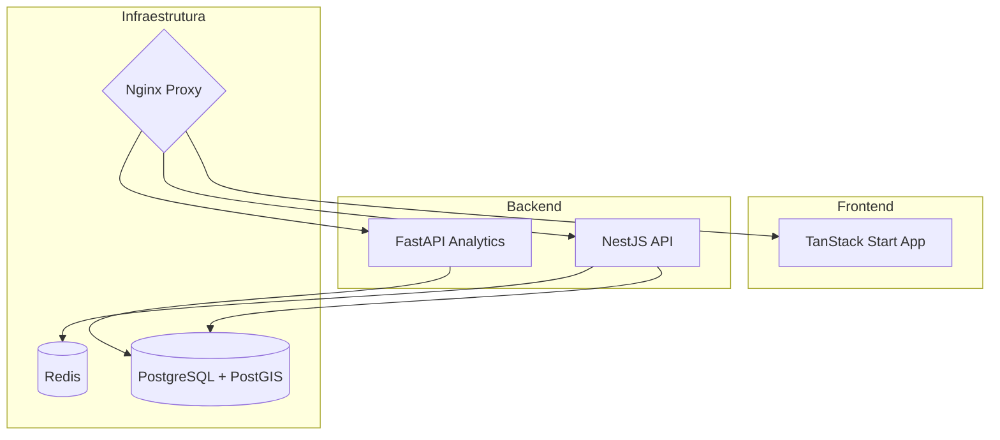
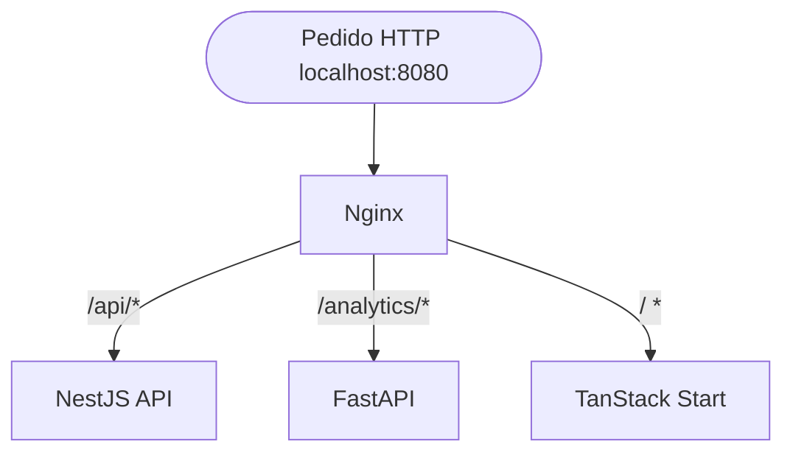

# Tech Stack

## Table of Contents
- [[Overview/Project Overview]]
- [[Overview/Quick Start Guide]]

## Tecnologias e Camadas da Plataforma

A plataforma EcoBairro está assente num conjunto de tecnologias modernas e robustas de forma a sustentar a sua vertente de microsserviços. Os componentes principais da stack dividem-se nas seguintes vertentes: aplicações, infraestrutura base e pacotes partilhados.

### Frontend
A aplicação de interface (`apps/web`) utiliza o **TanStack Start**, organizando-se em grupos de rotas (inicialmente placeholders). Todo o interface baseia-se em primitivos UI partilhados localizados em `src/components/ui`.

### Backend e API
O ponto de entrada principal de lógica da plataforma (`apps/api`) foi construído sobre **NestJS**. Atualmente inclui os fluxos fundamentais da Fase 1, nomeadamente autenticação (`/api/v1/auth/...`) e a gestão de cidadãos (`/api/v1/cidadaos/me`). 

### Serviço de Analytics
Com foco no suporte de telemetria e dados avançados, existe a aplicação `apps/analytics` baseada em **FastAPI**, que atualmente expõe rotas fundamentais de integridade (`/health` e `/ready`).

> **Sources:** `README.md:L9-L15` · `README.md:L64-L69` · `README.md:L90-L102`

## Infraestrutura e Base de Dados

A orquestração de todo este ecosistema num ambiente local é suportada pelo **Docker Compose** e unificada através de um proxy reverso configurado no **Nginx**, que mapeia o tráfego para a porta `8080`.
O armazenamento primário faz-se num motor **PostgreSQL** expandido com a extensão **PostGIS** para gestão de dados geográficos (como a localização de ecopontos). Em paralelo, utiliza-se **Redis** para caching, sessões ou gestão temporária de estado rápido.

> **Sources:** `README.md:L13-L15` · `README.md:L78-L82`

---
*[[index|← Back to Index]] · Generated by repowiki*
