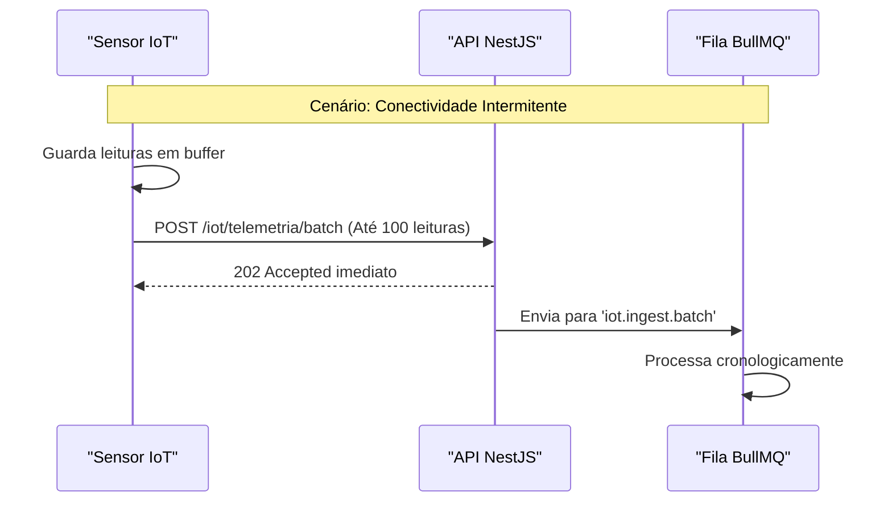

# IoT Telemetry Streams

## Table of Contents
- [[Realtime/WebSockets Architecture]]
- [[Realtime/Real-time Events]]

## Estratégias de Ingestão de Telemetria

O sistema expõe rotas HTTP altamente otimizadas para a ingestão contínua de telemetria dos sensores, preparadas para suportar ritmos de 10.000 mensagens por minuto. A autenticação é realizada com chaves de API estáticas via o cabeçalho `X-Device-Key`.

Existem três fluxos (streams) primários de comunicação:

1. **Stream Individual (`/iot/telemetria`)**: Utilizado para ingestão em tempo real de leituras simples.
2. **Stream em Lote (`/iot/telemetria/batch`)**: Vital para sensores instalados em locais com conectividade intermitente (zonas de sombra). Os dispositivos armazenam os dados em buffer interno e enviam o lote assim que a rede é restabelecida.
3. **Heartbeats (`/iot/heartbeat`)**: Stream leve utilizado exclusivamente para provar que o dispositivo continua online, sem necessidade de enviar dados de telemetria complexos.

> **Sources:** `docs/models/IoT e Dispositivos/IoT/2.2 Ingestão de Telemetria.md:L1-L5` · `docs/models/IoT e Dispositivos/IoT/2.2 Ingestão de Telemetria.md:L43`

## Estrutura de Dados dos Streams

O stream transporta dados muito específicos, onde apenas o `device_id`, `ecoponto_id` e o `timestamp_leitura` são obrigatórios (sendo que a ausência do `ecoponto_id` origina uma rejeição por RF-04).

O payload padrão de um evento individual contém:
- O nível da distância em centímetros (`nivel_raw_cm`) e a percentagem calculada (`nivel_enchimento`).
- O estado de diagnóstico do próprio sensor (`estado_reportado_sensor`).
- Métricas físicas como `battery_pct` (percentagem da bateria), `signal_rssi` (potência do sinal de rede), e `temperatura_c`.

No caso dos envios em lote (batch), cada pedido pode conter até 100 leituras num único array. Durante o processamento do lote, as mensagens são lidas em ordem cronológica estrita, garantindo que apenas a leitura mais recente acaba por atualizar a coluna `ecoponto_estado_atual` no estado global.

> **Sources:** `docs/models/IoT e Dispositivos/IoT/2.2 Ingestão de Telemetria.md:L7-L43`

---
*[[index|← Back to Index]] · Generated by repowiki*
