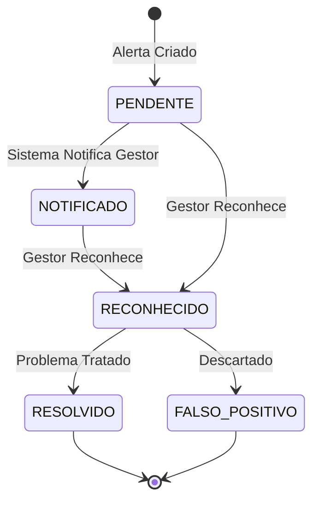
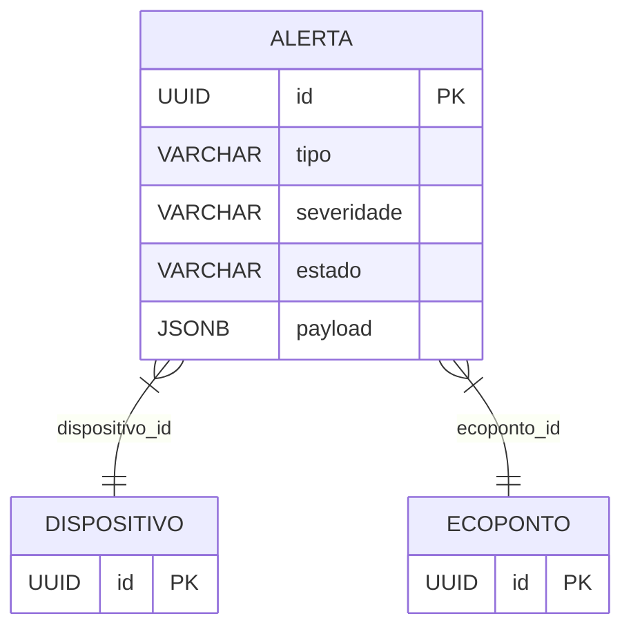

# Real-time Events

## Table of Contents
- [[Realtime/WebSockets Architecture]]
- [[Realtime/IoT Telemetry Streams]]

## Ciclo de Vida dos Alertas

O sistema gera e gere eventos em tempo real baseados no estado dos dispositivos IoT e nas leituras de telemetria. Estes eventos são traduzidos em **Alertas** que suportam operações como o dashboard operacional (RF-05) e a fila de pendentes para gestores.

> **Sources:** `docs/models/IoT e Dispositivos/IoT/base de dados/1.5 Schema PostgreSQL — iot_alertas.md:L36-L42`

## Tipos de Eventos e Severidade

Os eventos são categorizados por severidade (`INFO`, `AVISO`, `CRITICO`) e podem ser de vários tipos:
- **Estado do Ecoponto**: `ECOPONTO_CHEIO`, `ECOPONTO_AVARIADO`
- **Estado do Sensor**: `SENSOR_OFFLINE`, `BATERIA_FRACA`, `LEITURA_ANOMALA`, `SENSOR_RECUPERADO`

Os alertas incluem um payload em JSONB para contexto adicional e métricas que originaram o evento (como `valor_gatilho` e `limiar_configurado`).

> **Sources:** `docs/models/IoT e Dispositivos/IoT/base de dados/1.5 Schema PostgreSQL — iot_alertas.md:L7-L34`

## O Ciclo SENSOR_RECUPERADO

Um evento crítico de gestão é o ciclo de recuperação de sensores. Quando um dispositivo que estava offline volta a comunicar ativamente, o sistema emite automaticamente um evento do tipo `SENSOR_RECUPERADO` com severidade `INFO`. Isto conclui o ciclo do alerta de falha e é essencial para o cálculo do Tempo Médio Entre Falhas (TMEF).

> **Sources:** `docs/models/IoT e Dispositivos/IoT/base de dados/1.5 Schema PostgreSQL — iot_alertas.md:L62`

---
*[[index|← Back to Index]] · Generated by repowiki*
