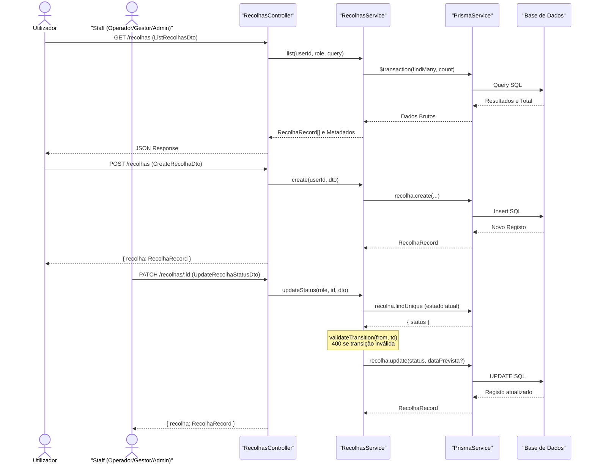

# Fluxo de Recolhas

A gestão do **Fluxo de Recolhas** é uma componente central do sistema, permitindo que os utilizadores autenticados solicitem e acompanhem recolhas (como resíduos ou outros materiais). O fluxo está assente em controladores e serviços NestJS, utilizando o Prisma para a persistência de dados. O acesso a este módulo encontra-se protegido e exige que o utilizador esteja autenticado através da guarda `[[Security/JwtAuthGuard]]`.

> **Sources:** `apps/api/src/recolhas/recolhas.controller.ts:L17-L19`, `apps/api/src/recolhas/recolhas.service.ts:L48-L54`

## Arquitetura e Integração

O módulo divide-se principalmente no `RecolhasController`, que gere os pedidos HTTP, e no `RecolhasService`, que encapsula a lógica de negócio e comunica com a base de dados via Prisma.



> **Sources:** `apps/api/src/recolhas/recolhas.controller.ts:L26-L40`, `apps/api/src/recolhas/recolhas.service.ts:L56-L95`

## Listagem de Recolhas

O endpoint `GET /recolhas` permite listar todas as recolhas de um utilizador específico. Os resultados podem ser filtrados por estado e suportam paginação.

- **Paginação:** São processados os parâmetros `page` (página atual, padrão: 1) e `pageSize` (itens por página, padrão: 10). Caso sejam fornecidos valores em formato de texto, o sistema tenta a sua conversão utilizando uma função utilitária `coerce`. Se a conversão falhar ou os valores forem inválidos, são aplicados os padrões.
- **Filtros:** É possível filtrar os resultados de forma opcional por `status` (estado da recolha).
- **Mapeamento:** O serviço executa uma transação no Prisma para obter os registos de recolha ordenados da mais recente para a mais antiga (`criadoEm: 'desc'`) em conjunto com a contagem total, mapeando depois as linhas da base de dados para o contrato padrão da aplicação (`RecolhaRecord`). A `data_pedido` é convertida e formatada para o padrão `pt-PT` (DD/MM/AAAA).

> **Sources:** `apps/api/src/recolhas/recolhas.service.ts:L7-L46`, `apps/api/src/recolhas/recolhas.service.ts:L56-L82`

## Criação de um Pedido de Recolha

Para efetuar um novo pedido, o cliente envia uma requisição `POST /recolhas`. Os dados essenciais suportados no corpo do pedido (via `CreateRecolhaDto`) incluem:

- `tipo`: O tipo principal da recolha.
- `subtipo`: A categoria específica ou a especificação da recolha.
- `morada`: A localização para a qual é solicitada a recolha.
- `obs`: Observações ou notas adicionais (opcional).

O controlador extrai automaticamente o `userId` do utilizador atualmente autenticado (`@CurrentUser()`), garantindo de forma segura que a recolha gerada fica intrinsecamente associada a essa conta, mitigando riscos de acesso indevido. O Prisma Service persiste a entidade e a resposta devolve o novo registo (convertido para `RecolhaRecord`). Para mais contexto da infraestrutura de modelos, consulte o `[[Database/Schema Overview]]`.

> **Sources:** `apps/api/src/recolhas/recolhas.controller.ts:L34-L40`, `apps/api/src/recolhas/recolhas.service.ts:L84-L95`

## Atualização de Estado (Staff)

O endpoint `PATCH /recolhas/:id` permite ao staff (OPERADOR, GESTOR, ADMIN) transitar o estado de uma recolha. O cidadão não tem acesso — tentativas devolvem 403.

**Corpo do pedido (`UpdateRecolhaStatusDto`):**
- `status`: novo estado (`pendente` | `agendado` | `concluido`) — obrigatório.
- `data_prevista`: data prevista no formato `DD/MM/AAAA` — opcional; `null` mantém o valor atual sem alteração.

**Máquina de estados — transições válidas:**

```
pendente ──► agendado ──► concluido
pendente ─────────────► concluido
```

Qualquer outra transição (ex.: `concluido → pendente`) é rejeitada com 400 (`VALIDATION_ERROR`).

**Implementação:** O serviço faz primeiro um `findUnique` para obter o estado atual. Se a recolha não existir, devolve 404 antes de tentar o `update`. A função `validateTransition()` valida a máquina de estados. A resposta é `{ recolha: RecolhaRecord }` (alinhada com `UpdateRecolhaResponse`).

> **Sources:** `apps/api/src/recolhas/recolhas.controller.ts:L46-L53`, `apps/api/src/recolhas/recolhas.service.ts:L104-L143`

---
Vá para: `[[index]]`
