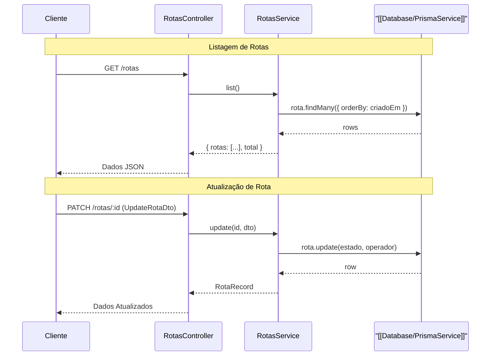

# Gestão de Rotas

O módulo de Gestão de Rotas é responsável pela disponibilização e atualização de informações sobre as rotas de recolha no sistema EcoBairro. A arquitetura divide-se num controlador de API para receber os pedidos HTTP e num serviço que interage com a base de dados.

## Controlador de Rotas

O `RotasController` expõe os endpoints para a gestão das rotas. Todos os acessos a este módulo exigem autenticação, estando protegidos pelo `[[Security/JwtAuthGuard]]`.

As operações suportadas são:
- **Listar Rotas**: O endpoint `GET /rotas` permite obter a listagem de todas as rotas registadas.
- **Atualizar Rota**: O endpoint `PATCH /rotas/:id` permite modificar parâmetros específicos de uma rota, recebendo um objeto de transferência de dados (`UpdateRotaDto`).

> **Sources:** apps/api/src/rotas/rotas.controller.ts:L14-L31

## Fluxo de Processamento de Dados

Abaixo apresenta-se um diagrama com o fluxo de interações entre as camadas durante as operações principais (listagem e atualização):

> **Sources:** apps/api/src/rotas/rotas.controller.ts:L22-L30, apps/api/src/rotas/rotas.service.ts:L37-L53

## Serviço de Rotas

O `RotasService` contém a lógica de negócio associada e efetua as transações com a base de dados através do `[[Database/PrismaService]]`.

### Regras de Listagem
A obtenção de todas as rotas (`list()`) traz os registos da base de dados ordenados de forma ascendente pela data em que foram criados (`criadoEm: 'asc'`). A resposta é formatada para incluir os dados mapeados de cada rota (com informações como nome, operador, estado, contagem de ecopontos, distância, duração, coordenadas no mapa `waypoints` e a cor) bem como um campo com o total de registos encontrados.

### Atualização
O método de atualização (`update()`) permite efetuar modificações parciais a uma rota específica. Atualmente, apenas suporta a modificação opcional dos seguintes atributos:
- `estado`: A condição ou fase em que a rota se encontra.
- `operador`: A entidade ou utilizador responsável pela rota.

### Mapeamento de Entidades
Sempre que uma rota é devolvida pelo serviço, os dados em bruto do Prisma são mapeados rigorosamente para a interface normalizada `[[Types/RotaRecord]]` (comprovada no contrato do projeto `[[Contracts/RotaRecord]]`). Este mapeamento converte campos de uso interno, como os `waypoints` e o `estado`, para as tipagens esperadas pelos consumidores da API.

> **Sources:** apps/api/src/rotas/rotas.service.ts:L6-L54

---
**Navegação**: [[index]]
