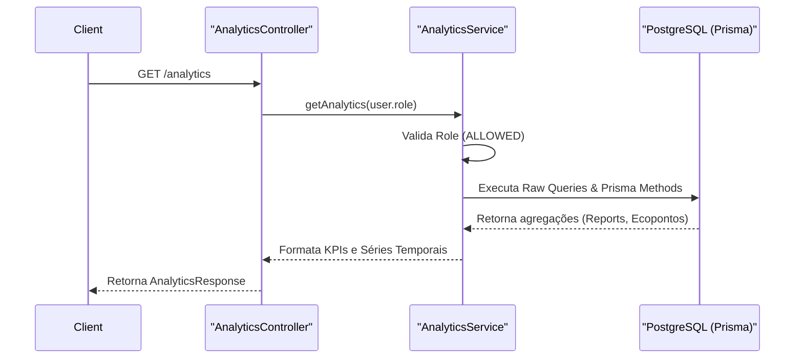
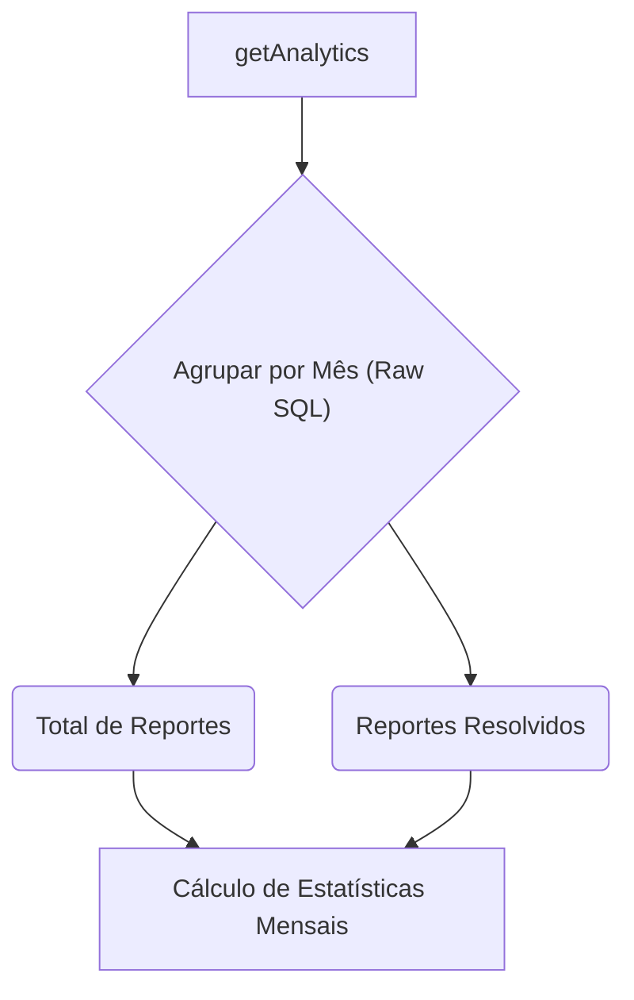

# Analytics & Queries

## Table of Contents
- [[Search/Search Architecture]]
- [[Search/Indexing Strategy]]

## Visão Geral das Analytics

O módulo de analytics é responsável por agregar dados operacionais da plataforma, fornecendo métricas essenciais como o número de reportes mensais, a taxa de resolução, distribuição por tipo e estatísticas por zona. Este módulo é acessível apenas a utilizadores com permissões adequadas (ex: `TECNICO_AUTARQUIA`, `TECNICO_CCDR`, `ADMIN`), sendo protegido pelo `JwtAuthGuard` a nível do controlador (`AnalyticsController`).

A recolha destes dados está centralizada no serviço `AnalyticsService`, que processa a informação e devolve um objeto formatado do tipo `AnalyticsResponse`.

> **Sources:** `apps/api/src/analytics/analytics.controller.ts:L8-L18` · `apps/api/src/analytics/analytics.service.ts:L23-L27`

## Estratégia de Queries

Para garantir o melhor compromisso entre flexibilidade e performance, o `AnalyticsService` utiliza duas abordagens distintas de acesso aos dados através do Prisma:

1. **Raw SQL (`$queryRaw`):** Utilizado para extrações que exigem agregações complexas não suportadas nativamente de forma eficiente pelo Prisma Client. Exemplos incluem a extração do ano e mês do campo `criado_em` para agrupamento de reportes.
2. **Prisma Client nativo:** Utilizado para contagens diretas (`count`), como o número total de utilizadores ou ecopontos ativos, e pesquisas com filtros de texto insensíveis a maiúsculas/minúsculas.

### Exemplo de Agregação Complexa

O cálculo de reportes e resoluções mensais faz uso intensivo da função `EXTRACT` do PostgreSQL:

> **Sources:** `apps/api/src/analytics/analytics.service.ts:L40-L56`

---
*[[index|← Back to Index]] · Generated by repowiki*
